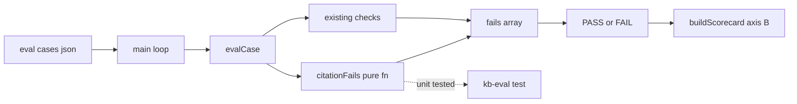

# Design Document: eval-citation-check

## Overview

**Purpose**: 評価ハーネス（`scripts/kb-eval.ts` + `eval/cases.json`）に「回答の出典（citation）が付いているか」を客観採点する仕組みを追加し、到達目標の軸 B′（正しくあり続ける）を測定可能にする。

**Users**: 評価基盤のメンテナが `bun run kb:eval` 実行時に、出典必須ケースの合否を軸別スコアカード上で確認する。

**Impact**: `Expect` に `citesSource` 観点を 1 つ追加し、`evalCase()` の採点に出典体裁の照合を足す。判定ロジックは純粋関数 `citationFails()` として切り出し、ライブ LLM/GitHub に触れずに `bun test` で回帰検証できるようにする。本番コード（`src/`）と既存の枠（軸集計・ゲート・スコアカード）は無改変。

### Goals
- `expect.citesSource: true` のケースで、回答本文に出典の体裁（`.md` 資料名 または コードの `path:line`）が含まれるかを客観判定する。
- `readPathIncludes` と `citesSource` の併用で「読んだファイルの path が回答本文に `path:line` 形式（行番号付き）で引用されているか」を厳格検査する。
- docs 由来・code 由来の B′ ケース（`axis: "B"`）を各 1 件以上追加し、満たさない回答が FAIL・満たす回答が PASS することを実証する。
- 既存 7 ケースを無改修で PASS、`citesSource` 未指定ケースの判定を不変に保ち、`bun run typecheck` をクリーンに保つ。

### Non-Goals
- 出典が意味的に正しいか（実在・該当箇所か）の検証、および回答が根拠に忠実か（幻覚の有無）の LLM ジャッジ。
- docs とコードの「ドリフト」検証（#30 が所有）、「次の一歩」など他の採点種別（#31 が所有）。
- 見出し（ファイル名を伴わないセクション名のみ）の照合。客観検出が困難なため出典体裁は**ファイル名/path 形式**に限定する（下記 Boundary Commitments 参照）。
- 本番コード `src/`（`buildSystem` 等）の変更、新規外部依存の追加。

## Boundary Commitments

### This Spec Owns
- `Expect` 型への `citesSource?: boolean` の追加。
- 出典体裁の判定を担う純粋関数 `citationFails(expect, answer): string[]` の定義と、その `evalCase()` からの呼び出し。
- `eval/cases.json` への B′ ケース（docs 由来・code 由来）の追加、および `eval/cases.sample.json` への `citesSource` 記載例の追従。
- 出典体裁の**検出規約**（`.md` 資料名の言及、またはコードの `path:line` 形式）の定義と、その回帰テスト。

### Out of Boundary
- 軸タグ（`axis`）・合否ゲート（`gate`）・スコアカード（`buildScorecard`/`formatScorecard`/`overallPassed`）の集計ロジック — eval-scorecard（#28）が所有。本 spec は `axis: "B"` として枠に載るだけで枠自体は触らない。
- 既存 `expect` フィールド（`toolsUsedAny` / `toolsUsedAll` / `source` / `argIncludes` / `readPathIncludes` / `answerIncludes` / `answerOmits`）の意味と判定。
- 出典の意味的正しさ・忠実性の判定、ドリフト検証、他採点種別。
- SKIP 判定（`needsGh`）と GitHub 未設定時の挙動 — 既存ロジックを再利用し変更しない。

### Allowed Dependencies
- `scripts/kb-eval.ts` 内の既存要素（`Expect`, `evalCase`, `Call`, `GH_TOOLS`）のみ。
- 標準の TypeScript/Bun ランタイム（正規表現・文字列操作）。**新規依存は追加しない。**
- `read_repo_file` 由来の `readPathIncludes` 値は既存フィールドを**読み取り専用で再利用**する（併用検査のため）。フィールドの意味は変えない。

### Revalidation Triggers
- `citationFails` の検出規約（正規表現）を変更する場合 → 追加した B′ ケースと `citation` 単体テストの再確認が必要。
- `Expect` の既存フィールドの意味を変える変更（本 spec では発生させない）→ eval-scorecard 側の後方互換前提の再検証。
- スコアカードの枠（`buildScorecard` 等）のシグネチャ変更（#28 側の変更）→ 本 spec の B′ ケースが `axis: "B"` として集計されるかの再確認。

## Architecture

### Existing Architecture Analysis

`scripts/kb-eval.ts` は「本番と同じ前処理（FTS 前置き＋`buildSystem`＋ツール群）を組み立て → ツールをラップして呼び出しトレースを記録 → `expect` と突き合わせて採点」する CLI。採点は `evalCase(expect, calls, answer)` に集約され、**「指定された項目だけ検査する」**（未指定は不問）方針を取る。`answer`（回答本文）は既に第 3 引数で渡っており、`answerIncludes`/`answerOmits` が本文照合の前例を提供している。集計層（`buildScorecard` 系）は純粋関数として分離され `test/kb-eval.test.ts` で単体検証されている。

本機能はこの `evalCase` の採点項目を 1 つ増やす**追記型の拡張**であり、既存の分岐・集計・SKIP 判定には触れない。

### Architecture Pattern & Boundary Map

**Selected pattern**: 既存 `evalCase` への採点項目追記 + 判定ロジックの純粋関数抽出（`buildScorecard` 等と同じ「副作用なし・export・`bun test`」パターン）。



**Key decisions**:
- 出典判定を `evalCase` 内にインライン展開せず、`citationFails(expect, answer): string[]` として切り出して export する。理由: LLM/GitHub 非依存の純粋関数として `bun test` で検出規約を回帰検証できる（tech.md「資格情報不要の純粋関数を test 対象」に整合）。`evalCase` 自体は現状 export されておらず、ライブ実行依存のため単体テストしにくい。
- `evalCase` は既存チェック群の末尾で `fails.push(...citationFails(expect, answer))` を呼ぶだけ。既存分岐は不変。
- 依存方向は現状維持（`main` → `evalCase` → `citationFails`（純粋））。上位から下位への一方向。

### Technology Stack

| Layer | Choice / Version | Role in Feature | Notes |
|-------|------------------|-----------------|-------|
| CLI / Runtime | TypeScript (strict, `noUncheckedIndexedAccess`) on Bun | `citationFails` の追加・`evalCase` からの呼び出し | 新規依存なし。正規表現・文字列のみ |
| Test | `bun test` | `citationFails` の検出規約を単体検証 | 既存 `test/kb-eval.test.ts` に追記 |
| Data | `eval/cases.json` / `eval/cases.sample.json`（JSON） | B′ ケース追加・記載例追従 | スキーマは `RawCase`/`Expect` に準拠 |

現行スタックからの逸脱・新規依存はなし。

## File Structure Plan

### Modified Files
- `scripts/kb-eval.ts` —
  - `Expect` に `citesSource?: boolean` を追加（L22-37 の interface）。
  - 純粋関数 `export function citationFails(expect: Expect, answer: string): string[]` を新設（`evalCase` の近傍、`buildScorecard` 等の純粋関数群と同じ帯に配置）。
  - `evalCase()` 末尾（`return fails` 直前, L123 付近）に `fails.push(...citationFails(expect, answer))` を追加。
- `eval/cases.json` —
  - docs 由来 B′ ケースを 1 件追加（`axis: "B"`, `source: "docs"`, `answerIncludes`, `citesSource: true`）。
  - code 由来 B′ ケースを 1 件追加（`axis: "B"`, `source: "code"`, `readPathIncludes`, `citesSource: true`）。
- `eval/cases.sample.json` —
  - `citesSource` の記載例を 1 行（既存の軸タグ例に倣ったコメント的ケース）追従追加。
- `test/kb-eval.test.ts` —
  - `citationFails` の単体テストを追加（import に `citationFails` を追加）。
  - 追加した B′ ケースが `eval/cases.json` に構造として存在すること（docs/code 各 1 件以上・`axis:"B"`・`citesSource:true`）を検証する構造テストを追加（既存の `readFileSync` import を再利用）。

各ファイルは単一責務: `kb-eval.ts`=判定ロジック、`cases.json`=本番評価データ、`cases.sample.json`=記載例、`kb-eval.test.ts`=回帰検証。

## Requirements Traceability

| Requirement | Summary | Components | Interfaces | Flows |
|-------------|---------|------------|------------|-------|
| 1.1 | 出典体裁の検査を行う | `citationFails` | `citationFails(expect, answer)` | evalCase 末尾で呼出 |
| 1.2 | 体裁欠如で FAIL（区別可能な理由） | `citationFails` | 戻り値 `string[]`（体裁欠如メッセージ） | fails へ push |
| 1.3 | 体裁ありなら FAIL を出さない | `citationFails` | 戻り値 `[]` | — |
| 2.1 | 併用時に読んだ path の path:line 引用を検査 | `citationFails` | `readPathIncludes` を含む `CODE_CITATION` 一致を照合 | 併用厳格ブロック |
| 2.2 | 行番号付き未引用で FAIL | `citationFails` | 戻り値（行番号付き未引用メッセージ） | fails へ push |
| 2.3 | path:line 引用ありなら FAIL を出さない | `citationFails` | 戻り値 `[]` | — |
| 3.1 | docs 由来 B′ ケース ≥1 | `eval/cases.json` | JSON ケース | 実行ループ |
| 3.2 | code 由来 B′ ケース ≥1 | `eval/cases.json` | JSON ケース | 実行ループ（GitHub 要 → 未設定は SKIP） |
| 3.3 | 満たす回答は PASS | `evalCase`+`citationFails` | — | ライブ実行 |
| 3.4 | 満たさない回答は FAIL | `evalCase`+`citationFails` | — | ライブ実行 |
| 4.1 | 既存 7 ケース無改修 PASS | `citationFails`（不作用） | `citesSource` 未指定 → `[]` | 回帰 |
| 4.2 | 未指定は判定不変 | `citationFails` | early return | — |
| 4.3 | 既存 `expect` 意味不変 | `evalCase` | 既存ブロック無改変 | — |
| 4.4 | 外部依存追加なし | `citationFails` | 正規表現のみ | — |
| 4.5 | typecheck クリーン | `Expect`/`citationFails` | optional boolean | `bun run typecheck` |

## Components and Interfaces

| Component | Domain/Layer | Intent | Req Coverage | Key Dependencies (P0/P1) | Contracts |
|-----------|--------------|--------|--------------|--------------------------|-----------|
| `citationFails` | eval 採点（純粋関数） | 出典体裁の欠如/未引用を fail 文の配列で返す | 1.1–1.3, 2.1–2.3, 4.2, 4.4 | `Expect`（P0） | Service（純粋関数） |
| `Expect.citesSource` | eval ケース期待値スキーマ | 出典必須の観点を宣言する | 1.1, 4.2, 4.5 | `Expect`（P0） | State（型） |
| B′ ケース群 | eval 評価データ | 出典採点を実データで実証する | 3.1–3.4 | `RawCase`/`Expect`（P0）, 既存 SKIP 判定（P1） | Batch（JSON データ） |

### eval 採点層

#### citationFails

| Field | Detail |
|-------|--------|
| Intent | 出典体裁の欠如と「読んだ path の未引用」を検出し、日本語の fail 文配列で返す純粋関数 |
| Requirements | 1.1, 1.2, 1.3, 2.1, 2.2, 2.3, 4.2, 4.4 |

**Responsibilities & Constraints**
- `expect.citesSource` が真のときのみ判定する。偽/未指定なら空配列を返す（Req 4.2 — 既存判定を一切変えない）。
- 出典体裁 = 次のいずれかが回答本文に出現すること:
  - **doc 引用**: `.md` を末尾に持つ資料名トークン。検出規約 `DOC_CITATION = /[\w./-]+\.md\b/`（例 `auth.md`, `docs/auth.md`）。
  - **code 引用**: 拡張子付き path に続く `:` と行番号。検出規約 `CODE_CITATION = /[\w./-]+\.[A-Za-z0-9]+:\d+/`（例 `db.ts:42`, `src/kb/db.ts:120`）。
  - どちらも無ければ体裁欠如の fail（Req 1.2）。両方いずれか出現で体裁観点は fail なし（Req 1.3）。
- **併用時は厳格分岐**（Req 2.1）: `expect.readPathIncludes` が指定されている場合は汎用体裁ではなく、**読んだ path を含む `path:line` 形式の引用が本文に出現するか**を検査する。具体的には、回答本文中の全 `CODE_CITATION` 一致（`path:line`）の中に、その path 部分へ `readPathIncludes` の部分文字列を含むものが 1 つ以上あることを要求する。無ければ「読んだ path が行番号付きで引用されていない」fail を積む（Req 2.2）。あれば fail なし（Req 2.3）。この厳格チェックは汎用体裁（doc/code いずれか）を内包するため、併用時は汎用チェックを重ねて実行しない。
- fail メッセージは体裁欠如（汎用）と「読んだ path の行番号付き未引用」（併用）を**別文言**にし、既存 fail（`answerIncludes` 等）と区別できるようにする（Req 1.2）。
- 副作用なし・入力不変（`buildScorecard` 等と同じ規約）。

**Dependencies**
- Inbound: `evalCase` — 採点末尾で呼び出し fails に連結（P0）
- Outbound: なし（純粋）
- External: なし（Req 4.4）

**Contracts**: Service ☑

##### Service Interface
```typescript
/**
 * 出典体裁（.md 資料名 または path:line）の欠如を検出して日本語 fail 文の配列で返す純粋関数。
 * readPathIncludes 併用時は汎用体裁ではなく「読んだ path を含む path:line 形式の引用が本文にあるか」を
 * 厳格検査する。citesSource が偽/未指定なら空配列（既存判定を変えない、Req 4.2）。副作用なし・入力不変。
 */
export function citationFails(expect: Expect, answer: string): string[];
```
- **Preconditions**: `answer` は最終回答本文（`evalCase` の第 3 引数と同一）。
- **Postconditions**: 戻り値は 0〜1 件の fail 文（`readPathIncludes` 未指定時は体裁欠如、指定時は「読んだ path の行番号付き未引用」）。`expect.citesSource` が真でなければ必ず `[]`。
- **Invariants**: `expect`・`answer` を変更しない。ネットワーク・I/O を行わない。

**Implementation Notes**
- Integration: `evalCase` の末尾に `fails.push(...citationFails(expect, answer));` を 1 行追加するのみ。既存ブロックは無改変。
- Validation: 検出規約は正規表現定数（`DOC_CITATION`/`CODE_CITATION`）としてファイル上部に定義し、テストと共有する。
- Risks: 汎用体裁側は過検出（無関係な `.md`/`path:line` 言及を出典と誤認）の余地がある。併用（code B′）側は「読んだ path を含む `path:line`」を要求するため厳格で、無関係な `path:line` では通らない。客観判定の性質上ゼロにはできないため、B′ ケースは体裁が明確に出る/出ない回答を誘発するよう著者が設計する。見出しのみの引用は検出対象外（Non-Goal）。

## System Flows

出典採点は `evalCase` 内の逐次照合であり、新たな非自明フローは生じない（既存の採点シーケンスに 1 ブロック追記するのみ）。ダイアグラムは Architecture の Boundary Map に集約し、本節は省略する。

## Error Handling

新たなエラー経路は導入しない。`citationFails` は例外を投げず、判定結果を fail 文の配列で返すのみ（既存 `evalCase` の fails 収集規約に一致）。不正な `citesSource` 型（boolean 以外）は TypeScript strict のコンパイル時型付けで排除され、`Expect` はランタイム検証対象外（既存方針を踏襲: `axis`/`gate` のみ `validateCases` で検証）。JSON パース失敗など既存のケース読込エラーは `main()` の既存ハンドラが処理する。

## Testing Strategy

### Unit Tests（`test/kb-eval.test.ts`, `bun test`・資格情報不要）
1. `citationFails`: `citesSource` 未指定 → `[]`（Req 4.2）。
2. `citationFails`: `citesSource:true` + 回答に `.md` 資料名（例 `auth.md`）→ `[]`（Req 1.3 doc 側）。
3. `citationFails`: `citesSource:true` + 回答に `path:line`（例 `db.ts:42`）→ `[]`（Req 1.3 code 側）。
4. `citationFails`: `citesSource:true` + 回答に体裁なし → 体裁欠如 fail 1 件（Req 1.2）。
5. `citationFails`: `citesSource:true` + `readPathIncludes:"db.ts"` + 回答に `src/kb/db.ts:42` あり → `[]`（Req 2.3）。
6. `citationFails`: `citesSource:true` + `readPathIncludes:"db.ts"` + 回答に `db.ts`（行番号なし）のみ、または無関係な `other.ts:5` のみ → 行番号付き未引用 fail（Req 2.2）。

### Integration / 構造テスト（`test/kb-eval.test.ts`）
7. `eval/cases.json` を読み、`axis:"B"` かつ `citesSource:true` の docs 由来（`source:"docs"`）・code 由来（`source:"code"` かつ `readPathIncludes` あり）ケースが各 1 件以上存在することを検証（Req 3.1, 3.2）。

### ライブ実行での実証（`bun run kb:eval`, 手動・課金あり）
8. 追加 B′ ケースで、出典を満たす回答が PASS・満たさない回答が FAIL になることを確認（Req 3.3, 3.4）。既存 7 ケースが無改修で PASS すること（Req 4.1）。
9. `bun run typecheck` がエラーなく完了すること（Req 4.5）。
