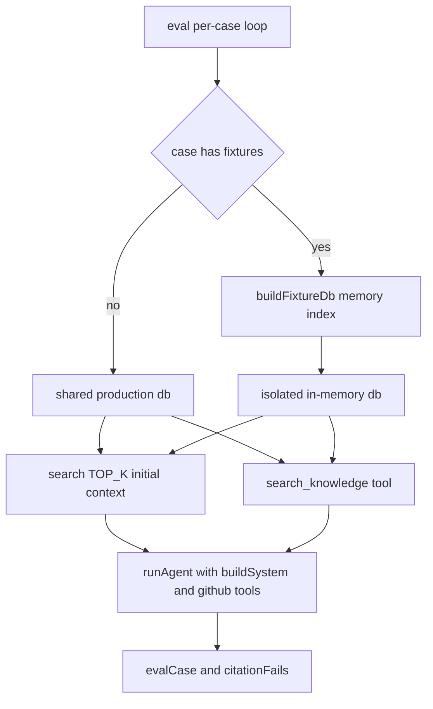
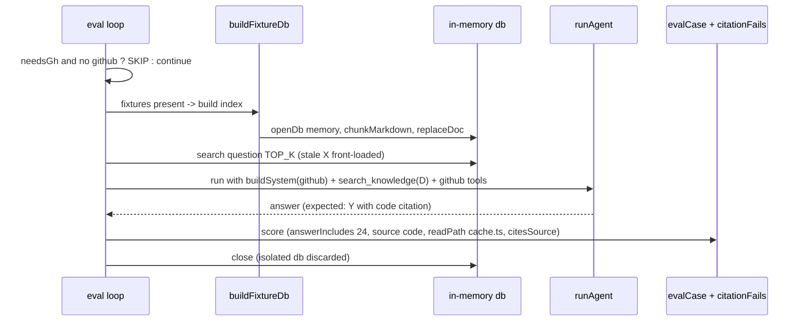

# Technical Design: eval-drift-tolerance

## Overview

**Purpose**: kb-bot の中核価値である「docs とコードが食い違ったらコードを優先する（prefer the code）」規則（`src/chat/core.ts` `buildSystem` L36-39）が実際に発火するかを、eval ハーネスで客観採点できるようにする。

**Users**: 評価基盤を保守する開発者。`bun run kb:eval`（GitHub 有効時）で、軸 B′（ドリフト耐性）の到達度をスコアカードで確認・回帰検知する。

**Impact**: 既存 eval ハーネス（`scripts/kb-eval.ts`）を拡張し、「古い doc（値 X）を提示しつつライブコード（値 Y）を参照可能にした状態で、bot がコードを根拠に Y を答えるか」を検査する **drift ケース**を追加する。これを実現するため、ケース単位で本番 KB と分離した **in-memory フィクスチャ索引**を組み立てる仕組みを導入する。本番コード `src/` は変更しない。

### Goals
- doc 古 × コード新の矛盾ケースで、コードを正答に採れたか（Y を述べ・コード出典・X 非主張）を客観採点する（1.1–1.5）。
- stale フィクスチャを本番 KB から分離したまま bot のコンテキストに確実に提示する（2.1–2.4）。
- GitHub 未設定時は既存 `needsGh` 規則で SKIP し誤 FAIL を出さない（3.1–3.2）。
- 既存ケース無改修 PASS・`src/` 不変・`bun run typecheck` クリーン・#28/#29 の枠を非改変（5.1–5.4）。

### Non-Goals
- `buildSystem` の prefer-the-code 規則そのものの文言変更・強化（規則は検証対象であり改修対象ではない）。
- 出典体裁の検査ロジック（`citesSource` = eval-citation-check/#29 が所有・実装済み。本設計は利用のみ）。
- 軸タグ・合否ゲート・スコアカードの枠（eval-scorecard/#28 が所有・実装済み。本設計は利用のみ）。
- doc 陳腐化の自動検出（`kb-prune`）／意味的忠実性の LLM ジャッジ。

## Boundary Commitments

### This Spec Owns
- **フィクスチャ索引の組み立て**: ケース単位で in-memory SQLite にフィクスチャ md を索引する `buildFixtureDb`（`scripts/kb-eval.ts` に新設・export）。
- **ケース定義の拡張**: `RawCase`/`Case` への任意フィールド `fixtures?: string[]` 追加と、その検証（`validateCases`）。
- **実行ループの db 分岐**: fixtures を持つケースだけ隔離 db を使い、`search()` と `searchKnowledgeTool()` の両方をその db に向ける配線。
- **drift ケースとフィクスチャ本文**: `eval/fixtures/*.md`（stale doc）と `eval/cases.json` への drift ケース（`axis:"B"`）。

### Out of Boundary
- `src/` 配下の追加・変更（`openDb`/`replaceDoc`/`chunkMarkdown`/`search`/`searchKnowledgeTool`/`buildSystem` は**呼び出すのみ**）。
- 採点フィールド（`source`/`answerIncludes`/`readPathIncludes`/`citesSource`）の判定ロジック（既存 `evalCase`/`citationFails` をそのまま利用）。
- スコアカード・軸集計・合否ゲートの集計ロジック（`buildScorecard` 等・#28 所有）。

### Allowed Dependencies
- `src/kb/db.ts`（`openDb` / `replaceDoc` / `search` / `countChunks`）、`src/kb/chunk.ts`（`chunkMarkdown`）、`src/agent/tools.ts`（`searchKnowledgeTool` / `formatHits`）、`src/chat/core.ts`（`buildSystem`）。すべて**読み取り利用のみ**。
- 依存方向は既存どおり `scripts/kb-eval.ts → src/kb, src/agent, src/chat`（下位は上位を知らない）。逆流を作らない。

### Revalidation Triggers
- `Expect` / `RawCase` / `Case` の型形状が変わる（drift ケース定義に影響）。
- `evalCase` / `citationFails` の採点契約が変わる（#29 側の変更）→ drift ケースの採点前提を再確認。
- `needsGh` の SKIP 条件が変わる（#28/ハーネス側）→ 3.1 の SKIP 前提を再確認。
- `openDb` の FTS スキーマ／`search` の契約が変わる（`src/kb` 側）→ フィクスチャ索引の互換を再確認。

## Architecture

### Existing Architecture Analysis
- ハーネスは起動時に**単一の共有 db** `openDb(dbPath())` を開き（L353）、全ケースで `search(db, question, TOP_K=5)` を初期コンテキストに前置きし（L384-386）、`searchKnowledgeTool(db)` と `githubTools(github)` をツールに与える（L378-381）。**FTS と `search_knowledge` は同一 db を指す**。
- 既存 `docs:` ケースは本番 `./kb.sqlite`（ingest 済み）の内容に依存する。よって共有 db をグローバルに差し替える方式は既存ケースを壊す（→ 却下、`research.md` 参照）。
- 採点は「指定項目だけ」検査する純粋関数 `evalCase` + `citationFails`。SKIP は `needsGh && !github` で判定し（L365-375）、集計・ゲート母数から除外される（#28 実装済み）。

### Architecture Pattern & Boundary Map
- **選択パターン**: ケース単位の索引ソース選択（per-case index source selection）。fixtures を持つケースのみ、隔離 in-memory db に切り替える最小分岐。
- **既存パターンの保持**: 「本番同等の前処理（FTS 前置き＋`buildSystem`＋ツール群）」「指定項目だけ採点」「SKIP 除外」をそのまま維持。差分は "どの db を検索源にするか" の一点に閉じる。



主要決定: fixtures ありのケースは `search()` と `searchKnowledgeTool()` の**両方**を同じ隔離 db に向ける（stale doc が前置き・ツール検索の双方で一貫して見える）。ライブコード Y は `githubTools` 経由で常時参照可能。

### Technology Stack
| Layer | Choice / Version | Role in Feature | Notes |
|-------|------------------|-----------------|-------|
| CLI / Runtime | Bun（既存） | eval 実行、`bun:sqlite` in-memory db | 新規依存なし |
| Data / Storage | SQLite FTS5 `unicode61`（既存） | フィクスチャの隔離索引 | `openDb(":memory:")` を再利用 |
| Batch | `scripts/kb-eval.ts`（既存・拡張） | ケース単位の db 分岐・`buildFixtureDb` | `src/` は不変 |

## File Structure Plan

### New Files
```
eval/
├── fixtures/
│   └── cache-ttl.md        # stale doc: 回答キャッシュは「無期限」(値 X)。Y(24h)を含めない
```

### Modified Files
- `scripts/kb-eval.ts` —
  - `RawCase` / `Case` に `fixtures?: string[]` を追加（任意・後方互換）。
  - `buildFixtureDb(fixturePaths: string[], baseDir: string): Database` を新設・export（in-memory 索引を組み立てて返す純粋寄り関数）。
  - `validateCases` に `fixtures` の型検査（配列・要素は文字列）を最小追加。
  - 実行ループ（L362-402）で「このケースが使う db」を分岐し、fixtures ありなら `buildFixtureDb` の db を `search()` と `searchKnowledgeTool()` に渡し、ケース終了時に `close()`。
- `eval/cases.json` — drift ケース 1 件を追加（`axis:"B"`、`fixtures:["cache-ttl.md"]`、`source:"code"`、`answerIncludes:["24"]`、`readPathIncludes:"cache.ts"`、`citesSource:true`）。
- `test/kb-eval.test.ts` — `buildFixtureDb` の索引・隔離・retrievable をユニット検証（資格情報不要）。

> `buildFixtureDb` を `src/` でなく `kb-eval.ts` に置くのは、既存の「テスト可能な純粋関数を kb-eval.ts から export する」慣習（`evalCase`/`citationFails`/`validateCases`）に合わせ、かつ `src/` 不変（5.2）を守るため。

## System Flows



ゲート条件: `needsGh`（drift ケースは `source:"code"` かつ `readPathIncludes` を持つため真）が真で GitHub 未設定なら、フィクスチャ索引を組む前に SKIP する（無駄な索引構築を避け、3.1 を満たす）。

## Requirements Traceability

| Requirement | Summary | Components | Interfaces | Flows |
|-------------|---------|------------|------------|-------|
| 1.1 | Y 提示＋コード出典＋X 非主張で PASS | Drift Case, evalCase, citationFails | `source:"code"`, `answerIncludes:["24"]`, `readPathIncludes`, `citesSource` | Score |
| 1.2 | X を述べる（Y を欠く）で FAIL・内訳記録 | evalCase | `answerIncludes` 欠落 fail 文 | Score |
| 1.3 | 情報源がコードであることを採点条件に | evalCase, citationFails | `source:"code"` + `readPathIncludes` | Score |
| 1.4 | Y でもコード出典なしで FAIL | citationFails | `citesSource` + `readPathIncludes` 厳格判定 | Score |
| 1.5 | 軸 B′ タグで集計・ゲートへ計上 | Drift Case | `axis:"B"` | — |
| 2.1 | stale doc を context 提示・Y コード参照可 | buildFixtureDb, Loop db 分岐 | `search(fixDb)` + `searchKnowledgeTool(fixDb)` + githubTools | per-case flow |
| 2.2 | 本番 KB を変更しない | buildFixtureDb | `openDb(":memory:")` 隔離 | per-case flow |
| 2.3 | フィクスチャを eval 配下に閉じる | eval/fixtures/*.md | ファイル配置 | — |
| 2.4 | 提示を矛盾成立の必須条件に | buildFixtureDb, Fixture authoring | 隔離 db にフィクスチャのみ→ `search` 必ずヒット | per-case flow |
| 3.1 | GitHub 未設定で SKIP・FAIL にしない | Loop（既存 needsGh） | `needsGh && !github` | gating |
| 3.2 | SKIP を集計・ゲートから除外 | 既存 buildScorecard（#28） | — | — |
| 4.1 | X と Y が明確に異なる | Fixture + Drift Case | 無期限 vs 24 | — |
| 4.2 | Y は安定実在・path:line 根拠 | Drift Case | `readPathIncludes:"cache.ts"` | — |
| 4.3 | フィクスチャは X 提示・Y 非含 | eval/fixtures/cache-ttl.md | 本文設計 | — |
| 5.1 | 既存ケース無改修 PASS | Loop db 分岐（fixtures 無は本番 db） | 後方互換分岐 | — |
| 5.2 | `src/` 不変 | File Structure Plan | scripts/eval のみ変更 | — |
| 5.3 | `bun run typecheck` クリーン | 型追加（`fixtures?`） | TS strict | — |
| 5.4 | #28/#29 の枠を非改変 | 既存関数の利用のみ | evalCase/citationFails/scorecard 無変更 | — |

## Components and Interfaces

| Component | Domain/Layer | Intent | Req Coverage | Key Dependencies | Contracts |
|-----------|--------------|--------|--------------|------------------|-----------|
| buildFixtureDb | scripts (eval) | フィクスチャ md を in-memory 索引化 | 2.1, 2.2, 2.4 | openDb, chunkMarkdown, replaceDoc (P0) | Batch |
| Case schema ext | scripts (eval) | `fixtures?` 追加＋検証 | 5.3, 5.4, 2.1 | validateCases (P1) | State |
| Loop db 分岐 | scripts (eval) | ケース単位で検索源 db を選択 | 2.1, 5.1 | buildFixtureDb, searchKnowledgeTool, search (P0) | Batch |
| Drift Case + Fixture | eval data | 矛盾ケースと stale doc | 1.1–1.5, 4.1–4.3 | evalCase, citationFails (P0) | State |

### scripts (eval)

#### buildFixtureDb

| Field | Detail |
|-------|--------|
| Intent | フィクスチャ md 群を本番 KB と分離した in-memory FTS 索引へ組み立てて返す |
| Requirements | 2.1, 2.2, 2.4 |

**Responsibilities & Constraints**
- `openDb(":memory:")` で空の隔離索引を作り、各フィクスチャ md を `chunkMarkdown` → `replaceDoc` で索引する。`docKey` はフィクスチャの相対パス（回答本文の出典表記とは無関係）。
- 本番 `./kb.sqlite` を一切開かない・変更しない（2.2）。返す db は呼び出し側が `close()` する。
- 副作用はファイル読み取りと in-memory db 構築のみ。`baseDir`（cases ファイルの `dirname` + `fixtures`）配下からのみ読む（2.3）。

**Dependencies**
- Outbound: `openDb` / `replaceDoc`（`src/kb/db.ts`）、`chunkMarkdown`（`src/kb/chunk.ts`）— 索引構築（P0）
- External: `bun:sqlite` in-memory、`node:fs` readFileSync（P0）

**Contracts**: Service [ ] / API [ ] / Event [ ] / Batch [x] / State [ ]

##### Batch / Job Contract
- Trigger: 実行ループが fixtures を持つケースを処理する直前に呼ぶ。
- Input / validation: `fixturePaths: string[]`（`validateCases` 通過済み・非空）、`baseDir: string`。各パスは `baseDir` 配下に解決。存在しない場合は明示エラーで fail-fast。
- Output / destination: `Database`（in-memory、フィクスチャ索引済み）。
- Idempotency & recovery: 呼び出しごとに新規 db を生成（状態を持たない）。ケース終了時 `close()` で破棄。

##### Service Interface
```typescript
import type { Database } from "bun:sqlite";

/** フィクスチャ md 群を本番 KB と分離した in-memory FTS 索引に組み立てて返す。
 *  返り値の db は呼び出し側が close() する。副作用: baseDir 配下のファイル読み取りのみ。 */
export function buildFixtureDb(fixturePaths: string[], baseDir: string): Database;
```
- Preconditions: `fixturePaths` は非空、各要素は `baseDir/fixtures/` 配下に実在する `.md`。
- Postconditions: 返す db は `countChunks(db) > 0`。本番 db は未オープン・未変更。
- Invariants: 本番 `dbPath()` を参照しない。プロセス間・ケース間で状態を共有しない。

#### Case schema extension（`fixtures?: string[]`）

| Field | Detail |
|-------|--------|
| Intent | ケースに任意のフィクスチャ参照を持たせ、drift ケースを宣言的に定義 |
| Requirements | 2.1, 5.3, 5.4 |

**Responsibilities & Constraints**
- `RawCase` と `Case` に `fixtures?: string[]` を追加（任意）。未指定ケースは従来と完全に同一挙動（後方互換、5.1/5.4）。
- `validateCases` に最小の型検査を追加: `fixtures` があるとき配列であり全要素が文字列であること。違反はエラー文（日本語）を返し、既存の axis/gate 検査方針と一致させる。

##### State Management
- State model: `Case.fixtures?: string[]`（宣言のみ・実行時に `buildFixtureDb` が消費）。
- 型は TS strict（`noUncheckedIndexedAccess`）に適合。`any` 不使用。

**Implementation Notes**
- Integration: 実行ループで `const caseDb = c.fixtures?.length ? buildFixtureDb(c.fixtures, baseDir) : db;` とし、`search(caseDb, ...)` と `searchKnowledgeTool(caseDb)` に統一して渡す。`try/finally` で fixtures 由来の db のみ `close()`（本番共有 db は閉じない）。
- Validation: `buildFixtureDb` は存在しないフィクスチャで fail-fast（誤検知より即時エラー）。
- Risks: fixtures ありケースは `source:"code"`/`readPathIncludes` を持つ想定で自動 `needsGh`→ GitHub 未設定時は索引構築前に SKIP（3.1）。

### eval data

#### Drift Case + Fixture（cache TTL ペア）

| Field | Detail |
|-------|--------|
| Intent | 「doc 無期限(X) × コード 24h(Y)」矛盾で prefer-the-code を検査 |
| Requirements | 1.1–1.5, 4.1–4.3 |

**Responsibilities & Constraints**
- フィクスチャ `eval/fixtures/cache-ttl.md`: 「回答キャッシュは無期限で失効しない」(X) を、いかにも本物の runbook 体裁で記述。値 Y（24/24時間）を**含めない**（4.3）。質問語（回答キャッシュ・有効期限・TTL 等）とトークンが重なるよう本文を構成し、隔離索引で確実に前置きされるようにする（2.4）。
- ケース定義（`eval/cases.json`）:
  - `question`: 例「回答キャッシュの有効期限（TTL）は何時間ですか？実装の根拠も示して。」
  - `expect`: `source:"code"`, `answerIncludes:["24"]`, `readPathIncludes:"cache.ts"`, `citesSource:true`
  - `axis:"B"`, `fixtures:["cache-ttl.md"]`
- **`answerOmits` は使わない**（`research.md` §Simplification）。X=「無期限」は否定文脈で言及されうるため誤 FAIL を招く。コード優先の判定は `answerIncludes:["24"]`＋`source:"code"`＋`readPathIncludes:"cache.ts"`＋`citesSource` の積で担保する。

**Contracts**: State [x]（データ定義のみ）

**Implementation Notes**
- Integration: 既存 `evalCase`（`source`/`answerIncludes`/`readPathIncludes`）＋ `citationFails`（`citesSource`＋`readPathIncludes` 厳格判定）で採点。新規採点ロジックは不要（1.1–1.4）。
- Validation: コード側 Y=24h は `src/cache.ts` `TTL_MS`（L9-12）に実在（4.2）。
- Risks: モデルがコードを読まず stale doc を鵜呑み→ `24` 欠落・`cache.ts` 非引用で FAIL。これは検知対象の挙動（設計欠陥ではない）。

## Error Handling
- **フィクスチャ不在**: `buildFixtureDb` は該当ファイルが無ければ即エラー（fail-fast）。原因パスをメッセージに含める。
- **不正な `fixtures` 型**: `validateCases` が実行前にエラー文を返し、既存の検証ゲートで停止（不正値の黙認を防ぐ、既存方針と一致）。
- **GitHub 未設定**: 既存 `needsGh` により SKIP（エラーでなく除外）。
- **db ライフサイクル**: fixtures 由来の in-memory db は `try/finally` で確実に `close()`。本番共有 db は閉じない（他ケースが継続使用）。

## Testing Strategy

### Unit Tests（`test/kb-eval.test.ts`、資格情報不要）
- `buildFixtureDb(["cache-ttl.md"], baseDir)` が `countChunks > 0` の db を返し、`search(db, "回答キャッシュ 有効期限 TTL")` が当該フィクスチャを**ヒットさせる**（2.1/2.4 の retrievable 保証）。
- `buildFixtureDb` を 2 回呼んで得た db が相互に独立（一方の索引が他方に漏れない）＝隔離の確認（2.2）。
- `validateCases` が `fixtures:["x.md"]` を許容し、`fixtures: "x.md"`（非配列）や `fixtures:[1]`（非文字列）をエラーにする（5.3/5.4、後方互換: `fixtures` 無しは従来どおり通過）。
- `buildFixtureDb` が存在しないパスで例外を投げる（fail-fast、Error Handling）。

### Integration / Live（`bun run kb:eval`、GitHub 有効時のみ・手動）
- drift ケースが、コードを読んで Y(24h) を `cache.ts:line` 出典付きで答えると PASS、stale doc を鵜呑みにすると FAIL（1.1/1.2）。
- GitHub 未設定で drift ケースが SKIP され、集計・ゲートに数えられない（3.1/3.2）。
- 既存 7 ケースが無改修で PASS（5.1）。

### Static
- `bun run typecheck` がクリーン（5.3）。
