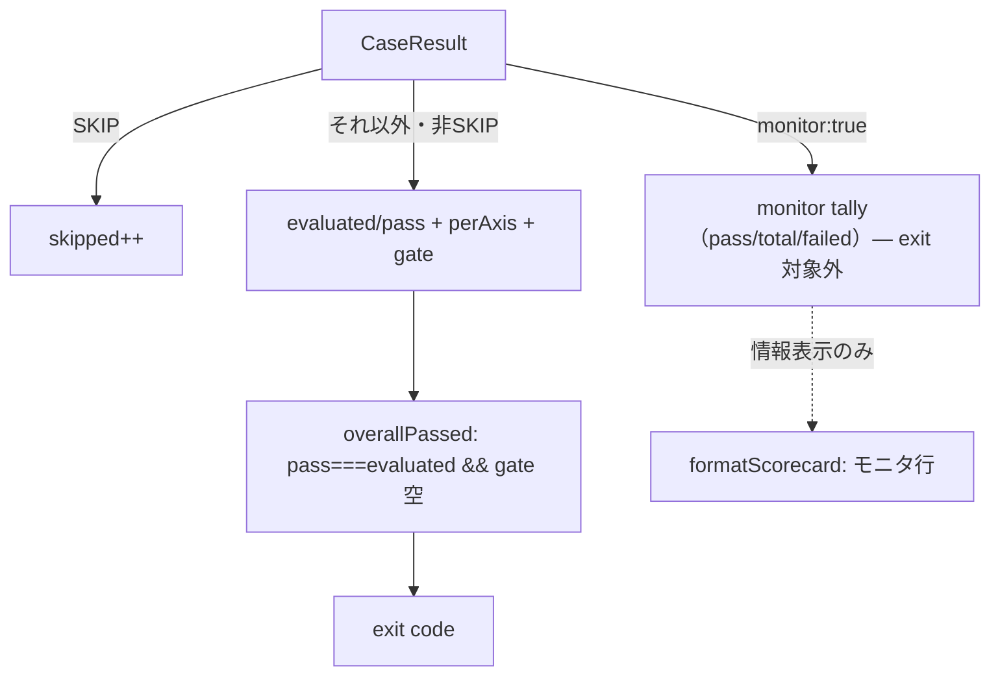

# Design Document: eval-monitor-cases

## Overview

**Purpose**: 確率的 soft テキストケース（次の一歩・出典）を **monitor（非ゲート・情報表示）** に分類し、`kb:eval` の exit コードから除外する。決定的ゲートは `bun test`、`kb:eval` は「安定した gate/scored ケースで exit を決め、soft ケースは並走モニタ」という役割分離を実現する。

**Users**: 評価基盤の保守者が、単発ライブ採点の言い回しの揺れで eval 全体が落ちることなく、soft ケースの傾向は情報として観測できる。

**Impact**: `scripts/kb-eval.ts` にケース分類 `monitor` を追加し、`buildScorecard` が monitor を別 tally に集計、`total`/`gate`/`perAxis`（exit 判定の母数）から除外する。`overallPassed` は現状式のまま（monitor が total に入らないので自動的に非ゲート化）。`formatScorecard` に monitor 行を追加。soft 目的のケース（D 次の一歩・B′ 出典 2 件）に `monitor:true` を付与。採点判定・昇格・キャッシュ・プロンプトは不変。

### Goals
- ケースを monitor に分類でき、monitor は実行・採点・表示されるが exit を左右しない。
- 既存の gate/scored/軸集計/スコアカードと `bun test` を後方互換に保つ。
- soft 目的ケースを monitor 化し、ゲートを安定ケースだけで決める。

### Non-Goals
- 採点判定ロジック（`evalCase`/`citationFails`/`nextStepFails`）の変更。
- per-check 粒度（ケース内の特定 expect だけ非ゲート化）。
- 昇格・キャッシュ・`buildSystem` の変更。

## Boundary Commitments

### This Spec Owns
- ケーススキーマの `monitor?: boolean`（`RawCase`/`Case`）と `validateCases` での検証、`CaseResult.monitor`。
- `buildScorecard`/`overallPassed`/`formatScorecard` の monitor 対応（`Scorecard.monitor` tally 追加・exit 除外・情報表示）。
- `eval/cases.json` の該当 soft ケースへの `monitor:true` 付与、`eval/cases.sample.json` の記載例。

### Out of Boundary
- `evalCase`/`citationFails`/`nextStepFails` の採点（不変）。
- 昇格（#40/#41）・キャッシュ・`buildSystem`・`runWithEscalation`。
- 既存 `gate`/`axis`/SKIP のセマンティクス（monitor 追加以外は不変）。

### Allowed Dependencies
- `scripts/kb-eval.ts` 内の既存要素（`RawCase`/`Case`/`CaseResult`/`Scorecard`/`buildScorecard`/`overallPassed`/`formatScorecard`/`validateCases`）。

### Revalidation Triggers
- `Scorecard` 形状や `overallPassed`/`buildScorecard` のセマンティクス変更 → `test/kb-eval.test.ts` の再確認。
- monitor 付与ケースの増減 → スコアカード表示・exit の再確認。

## Architecture

### Existing Architecture Analysis

ケースは 2 分類: `gate:true`（ハード安全ゲート）と無印 scored。`buildScorecard` は非 SKIP を `evaluated`/`pass`・`perAxis`・（gate なら）`gate` に集計。`overallPassed = total.pass===total.evaluated && gate.failed 空`。これらは純粋関数で `test/kb-eval.test.ts` が固定。

monitor は「実行・採点・表示するが exit の母数に含めない」第 3 分類。buildScorecard で monitor ケースを別 tally にし、`evaluated`/`pass`/`gate`/`perAxis` から除外すれば、`overallPassed` は無改修で monitor を無視する。

### Architecture Pattern & Boundary Map

**Selected pattern**: 集計の分類追加（`gate` と同じ「per-case boolean → buildScorecard で別勘定」パターン）。



**Key decisions**:
- monitor ケースは buildScorecard で `evaluated`/`pass`/`perAxis`/`gate` の**いずれにも数えず**、専用 `monitor` tally にのみ計上（→ `overallPassed` 現状式のまま非ゲート化）。
- monitor が gate と両立指定された場合は **monitor を優先**（非ゲート化）。安全ゲートを非ゲートにしたくないケースには monitor を付けない運用とし、実装は「monitor なら gate/scored 集計をスキップ」で単純化。
- 分類は per-case（ケース単位）。ケース内の一部 expect だけ非ゲートにする per-check は Non-Goal。

### Technology Stack

| Layer | Choice | Role | Notes |
|-------|--------|------|-------|
| Eval 集計 | TypeScript on Bun (`scripts/kb-eval.ts`) | monitor 分類・別 tally 集計・表示 | 純粋関数拡張・新規依存なし |
| Data | `eval/cases.json` / `eval/cases.sample.json` | soft ケースへの `monitor:true` 付与・記載例 | スキーマ準拠 |
| Test | `bun test`（`test/kb-eval.test.ts`） | monitor 集計/合否/検証の単体 | 資格情報不要 |

## File Structure Plan

### Modified Files
- `scripts/kb-eval.ts` —
  - `RawCase` に `monitor?: unknown`、`Case` に `monitor?: boolean` を追加。
  - `validateCases`: `monitor` が指定され真偽値以外ならケース名付きエラー（gate と同型）。
  - `CaseResult` に `monitor: boolean` を追加。`Scorecard` に `monitor: { pass: number; total: number; failed: string[] }` を追加。
  - `buildScorecard`: 非 SKIP かつ `r.monitor` のケースは monitor tally にのみ計上し `continue`（evaluated/pass/perAxis/gate に数えない）。
  - `formatScorecard`: `monitor.total > 0` のとき「モニタ（非ゲート）: pass/total」＋ FAIL 名を情報行として追加。
  - `overallPassed`: 無改修（monitor が total/gate に入らないため）。
  - main ループ: `const monitor = c.monitor ?? false;` を読み、per-case ログに monitor 表示、`CaseResult` に格納。
- `eval/cases.json` —
  - D 次の一歩ケース（`offersNextStep`）に `monitor:true`。
  - B′ 出典 2 ケース（`citesSource` 主目的: "B′ docs: …出典付き" と "B′ code: …path:line 引用付き"）に `monitor:true`。
  - ドリフト（"24" 主体）・plain code/docs・guard は据え置き（Req 3.3）。
- `eval/cases.sample.json` —
  - `monitor:true` の記載例を 1 件追従追加。
- `test/kb-eval.test.ts` —
  - `validateCases`: `monitor` 真偽値許容・非真偽値でエラーの単体。
  - `buildScorecard`: monitor ケースが evaluated/pass/gate/perAxis に入らず monitor tally に入ることの単体。
  - `overallPassed`: monitor の FAIL があっても gate/scored 全 PASS なら true の単体。
  - `eval/cases.json` 構造ガード: D と 出典 2 件が `monitor:true` であることの検証（Req 3.1/3.2）。

## Requirements Traceability

| Requirement | Summary | Components | Interfaces | Flows |
|-------------|---------|------------|------------|-------|
| 1.1 | monitor 分類を提供 | `RawCase`/`Case.monitor` | schema | — |
| 1.2 | 実行・採点・表示するが exit 母数から除外 | `buildScorecard` | monitor tally | 集計 |
| 1.3 | monitor FAIL は不合格にしない | `overallPassed`（無改修）+`buildScorecard` | total から除外 | exit |
| 1.4 | 不正 monitor 値を検出 | `validateCases` | 真偽値検証 | 検証 |
| 2.1 | monitor 未指定は従来どおり | `buildScorecard` | 既存分岐 | 集計 |
| 2.2 | 合否は gate/scored のみ | `overallPassed` | 無改修 | exit |
| 2.3 | 軸/ゲート/総合は保持・monitor 別表示 | `formatScorecard` | monitor 行追加 | 表示 |
| 2.4 | 既存 scorecard テスト無改修で緑 | 全体 | 後方互換 | `bun test` |
| 3.1 | 次の一歩ケースを monitor に | `eval/cases.json` | `monitor:true` | データ |
| 3.2 | 出典ケースを monitor に | `eval/cases.json` | `monitor:true` | データ |
| 3.3 | ルーティング/事実/ドリフト/安全は据え置き | `eval/cases.json` | monitor 無し | データ |
| 4.1 | typecheck クリーン | 全体 | — | `bun run typecheck` |
| 4.2 | 既存テスト維持 | 全体 | — | `bun test` |
| 4.3 | 採点/昇格/cache/buildSystem 不変 | （非変更） | — | — |

## Components and Interfaces

| Component | Domain/Layer | Intent | Req Coverage | Key Dependencies | Contracts |
|-----------|--------------|--------|--------------|------------------|-----------|
| `monitor` 分類（schema+検証） | eval ケース | 非ゲート指定 | 1.1, 1.4, 2.1 | `RawCase`/`Case`/`validateCases`（P0） | State |
| `buildScorecard`（拡張） | eval 集計 | monitor を別 tally・exit 除外 | 1.2, 1.3, 2.1, 2.3 | `CaseResult`/`Scorecard`（P0） | Service（純粋） |
| `formatScorecard`（拡張） | eval 表示 | monitor 行の情報表示 | 2.3 | `Scorecard`（P0） | Service（純粋） |
| monitor 付与ケース | eval データ | soft ケースを非ゲート化 | 3.1–3.3 | `RawCase`（P0） | Batch |

### buildScorecard（monitor 対応）

**Responsibilities & Constraints**
- 非 SKIP かつ `r.monitor === true`: `monitor.total++`、PASS なら `monitor.pass++`、FAIL/ERROR なら `monitor.failed.push(r.name)`。その後 `continue`（evaluated/pass/perAxis/gate に一切数えない）。
- それ以外は従来どおり（後方互換, Req 2.1）。
- 入力不変・副作用なし（既存規約）。

**Service Interface（型の追加）**
```typescript
export interface Scorecard {
  perAxis: AxisTally[];
  gate: { failed: string[]; total: number };
  monitor: { pass: number; total: number; failed: string[] }; // 非ゲート・情報表示
  total: { pass: number; evaluated: number; skipped: number };
}
```
- **Postconditions**: monitor ケースは `total`/`gate`/`perAxis` に現れない。`overallPassed` は monitor を無視する。

**Implementation Notes**
- `overallPassed` は変更不要（monitor が total/gate に入らない）。既存テストは monitor 未指定なので不変で緑（Req 2.4）。
- Risks: monitor+gate 両指定時は monitor 優先（安全ゲートは monitor を付けない運用）。運用ミス防止のため付与ケースを限定する。

## Error Handling
`validateCases` が `monitor` の非真偽値をケース名付きで報告（既存 gate 検証と同型）。それ以外の新エラー経路なし。

## Testing Strategy

### Unit Tests（`test/kb-eval.test.ts`, `bun test`・資格情報不要）
1. `validateCases`: `monitor:true/false` 許容、非真偽値でケース名付きエラー（Req 1.4）。
2. `buildScorecard`: monitor ケースは `total.evaluated`/`perAxis`/`gate` に入らず `monitor` tally に入る（Req 1.2）。
3. `buildScorecard`: monitor と scored/gate 混在で、monitor FAIL は `total` を汚さない（Req 1.3）。
4. `overallPassed`: monitor FAIL があっても gate/scored 全 PASS なら true（Req 1.3/2.2）。
5. `formatScorecard`: monitor 行が pass/total と FAIL 名を含む（Req 2.3）。
6. 既存 scorecard/validateCases テストが無改修で緑（Req 2.4）。
7. `eval/cases.json` 構造ガード: D（`offersNextStep`）と 出典 2 件（`citesSource`）が `monitor:true`（Req 3.1/3.2）。

### ライブ実行での実証（`bun run kb:eval`, 手動・課金あり）
8. soft ケースが FAIL しても exit 0（gate/scored 全 PASS 時）、スコアカードに「モニタ（非ゲート）」行が出ることを観測（Req 1.3/2.3）。
