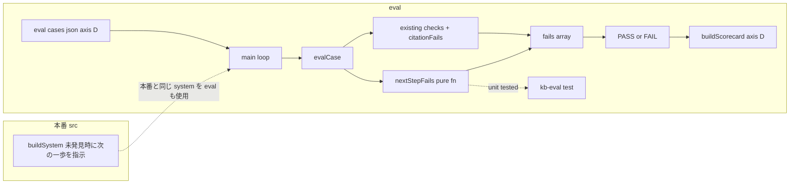

# Design Document: eval-next-step

## Overview

**Purpose**: 未発見時に kb-bot が「次の一歩」（対象名・キーワードの補足を促す／言い換え／資料追加で答えられる旨）を返すよう `buildSystem` を最小追記し、その振る舞いを評価ハーネス（`scripts/kb-eval.ts` + `eval/cases.json`）で客観採点できるようにする。到達目標の軸 D（行き止まらない）を測定可能にする。

**Users**: エンドユーザー（非エンジニア）は未発見時に次の行動を得られ、評価基盤のメンテナは `bun run kb:eval` 実行時に軸 D の合否を軸別スコアカードで確認する。

**Impact**: 本番側は `src/chat/core.ts` の `buildSystem` の未発見指示（L29）に「次の一歩を 1 文添える」文を足すのみ（[Safety]/[Output style] は不変、出力言語自動判別も不変）。eval 側は `Expect` に `offersNextStep` 観点を 1 つ追加し、判定を純粋関数 `nextStepFails()` として切り出して `evalCase()` 末尾から呼ぶ。既存の枠（軸集計・ゲート・スコアカード）と出典/ドリフト判定は無改変。

### Goals
- 未発見質問に対し、回答が (a) 見つからない旨 と (b) 具体的な次の一歩 を含むよう `buildSystem` を最小追記する（推測はしない）。
- `expect.offersNextStep: true` のケースで、回答本文に「次の一歩」相当の手掛かりが含まれるかを、過剰一致を避ける複数語 OR で客観判定する。
- 軸 D ケース（`axis: "D"`, `offersNextStep: true`）を追加し、次の一歩を返せば PASS・突き放せば FAIL になることを実証する（決定的部分は純粋関数の単体テストで担保）。
- 既存ケースを無改修で PASS、`offersNextStep` 未指定ケースの判定を不変に保ち、`bun run typecheck` をクリーンに保つ。

### Non-Goals
- 「近い情報のサジェスト（部分ヒットの提示）」等の retrieval / 検索機能拡張（将来 A 軸）。
- 昇格トリガ・モデル構成・キャッシュ方針の変更。
- 出典必須・忠実性（`eval-citation-check` / #29）、ドリフト耐性（`eval-drift-tolerance` / #30）、軸タグ・ゲート・スコアカードの枠（`eval-scorecard` / #28）のロジック改変。
- 「次の一歩」の意味的な適切さ（提案が本当に有用か）の LLM ジャッジ。客観検出は語彙 OR に限定する。

## Boundary Commitments

### This Spec Owns
- `src/chat/core.ts` `buildSystem` の**未発見時指示（L29）への 1 文追記**（次の一歩を促す。[Safety]/[Output style] は弱めない）。
- `Expect` 型への `offersNextStep?: boolean` の追加。
- 「次の一歩」判定を担う純粋関数 `nextStepFails(expect, answer): string[]` の定義と、`evalCase()` からの呼び出し。
- 「次の一歩」検出規約（手掛かり語彙の複数語 OR = `NEXT_STEP_CUES`）の定義とその回帰テスト。
- `eval/cases.json` への軸 D ケース追加、および `eval/cases.sample.json` への `offersNextStep` 記載例の追従。

### Out of Boundary
- 軸タグ（`axis`）・合否ゲート（`gate`）・スコアカード（`buildScorecard`/`formatScorecard`/`overallPassed`）の集計ロジック — eval-scorecard（#28）が所有。本 spec は `axis: "D"` として枠に載るだけ。
- 出典体裁（`citationFails`/`citesSource`）・ドリフト判定のロジック — #29/#30 が所有。
- 既存 `expect` フィールド（`toolsUsedAny`/`toolsUsedAll`/`source`/`argIncludes`/`readPathIncludes`/`answerIncludes`/`answerOmits`/`citesSource`）の意味と判定。
- `buildSystem` 以外の本番コード（`src/` の他モジュール）、SKIP 判定（`needsGh`）。

### Allowed Dependencies
- `src/chat/core.ts` の `buildSystem`（本文文字列の末尾近傍への 1 文追加のみ）。
- `scripts/kb-eval.ts` 内の既存要素（`Expect`, `evalCase`, `Call`）と、標準 TypeScript/Bun ランタイム（文字列操作）。**新規依存は追加しない。**
- `docs/USAGE.ja.md`「見つかりませんでした」節の文言方針（対象名・キーワードを足す／言い換え／資料追加で答えられる）を「次の一歩」の内容基準として参照。

### Revalidation Triggers
- `NEXT_STEP_CUES`（検出語彙）を変更する場合 → 追加した D ケースと `nextStepFails` 単体テストの再確認。
- `buildSystem` の未発見時文言をさらに変更する場合 → 軸 D ケースの再実行確認、および #29/#30 の未発見系ケースへの波及確認。
- `Expect` 既存フィールドの意味変更（本 spec では発生させない）→ eval-scorecard 側の後方互換前提の再検証。

## Architecture

### Existing Architecture Analysis

`scripts/kb-eval.ts` は「本番と同じ前処理（FTS 前置き＋`buildSystem`＋ツール群）→ ツール呼び出しトレース記録 → `expect` と突き合わせ採点」する CLI。採点は `evalCase(expect, calls, answer)` に集約され「指定された項目だけ検査する」方針。`answer`（回答本文）は第 3 引数で渡り、`answerIncludes`/`answerOmits` と `citationFails(expect, answer)` が本文照合の前例を提供している。集計層は純粋関数で分離され `test/kb-eval.test.ts` で単体検証。

本機能は (1) `buildSystem` の未発見時プロンプトに 1 文足す本番側変更、(2) その振る舞いを測る `evalCase` の採点項目 1 個追加（`citationFails` と同型の純粋関数抽出）の**追記型拡張**で、既存の分岐・集計・SKIP 判定には触れない。

### Architecture Pattern & Boundary Map

**Selected pattern**: `buildSystem` への最小プロンプト追記 + `evalCase` への採点項目追記（判定は純粋関数 `nextStepFails` に抽出。`citationFails`/`buildScorecard` と同じ「副作用なし・export・`bun test`」パターン）。



**Key decisions**:
- 「次の一歩」判定を `evalCase` にインライン展開せず `nextStepFails(expect, answer): string[]` として export する。理由: LLM/GitHub 非依存の純粋関数として `bun test` で検出規約を回帰検証できる（tech.md「資格情報不要の純粋関数を test 対象」に整合）。`citationFails` と完全同型。
- `evalCase` は既存チェック群の末尾（`return fails` 直前、`citationFails` 呼び出しの隣）で `fails.push(...nextStepFails(expect, answer))` を呼ぶだけ。既存分岐は不変。
- プロンプト追記は既存の未発見文（L29）に**連結する 1 文**に限定し、[Safety]/[Output style] の行や GitHub ブロックには触れない。出力言語自動判別は既存規則が支配するため文言追加のみで保たれる。
- 過剰一致回避（Req 2.3）: 検出は単語部分一致の OR ではなく、「次の一歩」に固有の手掛かり語（キーワード補足／言い換え／資料追加 等）を複数語 OR で照合する `NEXT_STEP_CUES` を用いる。

### Technology Stack

| Layer | Choice / Version | Role in Feature | Notes |
|-------|------------------|-----------------|-------|
| CLI / Runtime | TypeScript (strict, `noUncheckedIndexedAccess`) on Bun | `nextStepFails` 追加・`evalCase` からの呼出 | 新規依存なし。文字列 `includes` のみ |
| 本番 | TypeScript on Bun (`src/chat/core.ts`) | `buildSystem` の未発見時 1 文追記 | 文字列テンプレの変更のみ |
| Test | `bun test` | `nextStepFails` の検出規約を単体検証 | 既存 `test/kb-eval.test.ts` / `test/systemPrompt.test.ts` に追記 |
| Data | `eval/cases.json` / `eval/cases.sample.json`（JSON） | 軸 D ケース追加・記載例追従 | スキーマは `RawCase`/`Expect` に準拠 |

現行スタックからの逸脱・新規依存はなし。

## File Structure Plan

### Modified Files
- `src/chat/core.ts` —
  - `buildSystem` の `base` 文字列内、未発見時指示（`When you cannot find the fact, do not guess; state that you could not find it in the knowledge base ...`, L29）に「見つからない旨に加えて、次の一歩（対象名・キーワードの補足、言い換え、資料追加で答えられる旨のいずれか）を 1 文添える」旨を英語で連結する。[Safety]/[Output style]/GitHub ブロックは無改変。
- `scripts/kb-eval.ts` —
  - `Expect` に `offersNextStep?: boolean` を追加（L25-42 の interface）。
  - 検出語彙定数 `export const NEXT_STEP_CUES: string[]`（またはパターン配列）を `DOC_CITATION`/`CODE_CITATION` と同じ帯に定義。
  - 純粋関数 `export function nextStepFails(expect: Expect, answer: string): string[]` を新設（`citationFails` の近傍）。
  - `evalCase()` 末尾（`fails.push(...citationFails(...))` の直後、`return fails` 直前）に `fails.push(...nextStepFails(expect, answer))` を追加。
- `eval/cases.json` —
  - 軸 D ケースを 1 件追加（`axis: "D"`, `offersNextStep: true`, 既存 guard と整合する `answerOmits: ["おそらく","推定では","と思われます"]`）。質問は KB にもコードにも事実が無い「未発見」内容にする。
- `eval/cases.sample.json` —
  - `offersNextStep` の記載例を 1 件追従追加。
- `test/kb-eval.test.ts` —
  - `nextStepFails` の単体テストを追加（import に `nextStepFails` を追加）。
  - 追加した軸 D ケースが `eval/cases.json` に構造として存在すること（`axis:"D"` かつ `offersNextStep:true` が 1 件以上）を検証する構造テストを追加（既存 `readFileSync` import を再利用）。
- `test/systemPrompt.test.ts` —
  - `buildSystem()` の出力に「次の一歩」を促す指示が含まれること（および [Safety]/[Output style] の既存文言が保持されていること）を検証するテストを追加。

各ファイルは単一責務: `core.ts`=本番プロンプト、`kb-eval.ts`=判定ロジック、`cases.json`=本番評価データ、`cases.sample.json`=記載例、`*.test.ts`=回帰検証。

## Requirements Traceability

| Requirement | Summary | Components | Interfaces | Flows |
|-------------|---------|------------|------------|-------|
| 1.1 | 未発見時に見つからない旨＋次の一歩を返す | `buildSystem` | 未発見文への 1 文追記 | 本番/eval の system 生成 |
| 1.2 | 推測せず guard 禁止語を使わない | `buildSystem` | 既存「do not guess」を保持し追記 | — |
| 1.3 | 次の一歩を質問と同じ言語で | `buildSystem` | 既存の言語自動判別規則を保持 | — |
| 1.4 | [Safety]/[Output style] を弱めない | `buildSystem` | 未発見文のみ変更・他行不変 | — |
| 2.1 | offersNextStep 指定時に検査 | `nextStepFails` | `nextStepFails(expect, answer)` | evalCase 末尾で呼出 |
| 2.2 | 手掛かり欠如で FAIL（区別可能な理由） | `nextStepFails` | 戻り値 `string[]`（欠如メッセージ） | fails へ push |
| 2.3 | 過剰一致回避の複数語 OR | `NEXT_STEP_CUES`+`nextStepFails` | 語彙 OR 照合 | — |
| 2.4 | 未指定/偽なら判定不変 | `nextStepFails` | early return `[]` | — |
| 3.1 | 軸 D ケース ≥1（offersNextStep:true） | `eval/cases.json` | JSON ケース | 実行ループ |
| 3.2 | 次の一歩提示は PASS | `evalCase`+`nextStepFails` | — | ライブ実行 |
| 3.3 | 突き放しは FAIL | `nextStepFails` | 手掛かりなし→fail | ライブ実行＋単体テスト |
| 3.4 | guard（answerOmits）と両立 | `eval/cases.json` | 同ケースに `answerOmits` 併記 | evalCase 既存分岐 |
| 4.1 | 既存ケース無改修 PASS | `nextStepFails`（不作用）+`buildSystem` | `offersNextStep` 未指定→`[]` | 回帰 |
| 4.2 | 既存 eval 枠/出典/ドリフト不変 | `evalCase` | 既存ブロック無改変 | — |
| 4.3 | typecheck クリーン | `Expect`/`nextStepFails` | optional boolean | `bun run typecheck` |
| 4.4 | buildSystem 以外の src 不変 | `buildSystem` のみ変更 | — | — |

## Components and Interfaces

| Component | Domain/Layer | Intent | Req Coverage | Key Dependencies (P0/P1) | Contracts |
|-----------|--------------|--------|--------------|--------------------------|-----------|
| `buildSystem`（追記） | 本番プロンプト | 未発見時に次の一歩を促す 1 文を足す | 1.1–1.4, 4.4 | `src/chat/core.ts`（P0） | State（文字列） |
| `nextStepFails` | eval 採点（純粋関数） | 次の一歩の手掛かり欠如を fail 文配列で返す | 2.1–2.4, 3.3, 4.1 | `Expect`（P0）, `NEXT_STEP_CUES`（P0） | Service（純粋関数） |
| `Expect.offersNextStep` | eval ケース期待値スキーマ | 次の一歩必須の観点を宣言 | 2.1, 4.1, 4.3 | `Expect`（P0） | State（型） |
| 軸 D ケース | eval 評価データ | 次の一歩採点を実データで実証 | 3.1–3.4 | `RawCase`/`Expect`（P0） | Batch（JSON） |

### 本番プロンプト層

#### buildSystem（未発見時追記）

| Field | Detail |
|-------|--------|
| Intent | 未発見時に「見つからない旨＋次の一歩」を返させる 1 文を既存指示に連結 |
| Requirements | 1.1, 1.2, 1.3, 1.4, 4.4 |

**Responsibilities & Constraints**
- 対象は `base` 文字列内の未発見文（L29）のみ。既存の「do not guess; state that you could not find it in the knowledge base」を保持し、その直後に「加えて、解決に近づく次の一歩（対象名やキーワードの補足を促す／言い換えの提案／資料を追加すれば答えられる旨のいずれか）を 1 文で簡潔に添える」旨を英語で追記する。
- [Safety]・[Output style]・[Routing]・[Audience]・GitHub ブロック・言語自動判別行は**無改変**（Req 1.4, 1.3）。
- 推測の禁止（Req 1.2）は既存文の「do not guess」を維持することで担保する。
- GitHub 有無・operator extra の連結順序（`withGh` / `add`）は変更しない。

**Implementation Notes**
- Integration: `base` テンプレートリテラルの該当箇所を書き換えるのみ。関数シグネチャ・戻り値・呼び出し側は不変。
- Validation: `test/systemPrompt.test.ts` で「次の一歩」相当の語が出力に含まれ、かつ [Safety]/[Output style] の既存キーフレーズが残ることを検査。

### eval 採点層

#### nextStepFails

| Field | Detail |
|-------|--------|
| Intent | `offersNextStep` 指定時に、回答本文へ「次の一歩」の手掛かりが含まれるかを検査し、欠如を日本語 fail 文配列で返す純粋関数 |
| Requirements | 2.1, 2.2, 2.3, 2.4, 3.3, 4.1 |

**Responsibilities & Constraints**
- `expect.offersNextStep` が真のときのみ判定する。偽/未指定なら空配列を返す（Req 2.4, 4.1 — 既存判定を一切変えない）。
- 手掛かり検出 = `NEXT_STEP_CUES` のいずれか 1 つ以上が回答本文に出現すること（複数語 OR, Req 2.3）。1 つも無ければ「次の一歩が示されていない」fail を積む（Req 2.2, 3.3）。
- fail メッセージは他の fail（`answerIncludes`/`citationFails` 等）と区別できる固有文言にする（Req 2.2）。
- 副作用なし・入力不変（`citationFails`/`buildScorecard` と同じ規約）。

**Dependencies**
- Inbound: `evalCase` — 採点末尾で呼び出し fails に連結（P0）
- Outbound: `NEXT_STEP_CUES`（同一モジュールの定数, P0）
- External: なし（Req 4.2）

**Contracts**: Service ☑

##### Service Interface
```typescript
/**
 * 「次の一歩」の手掛かり欠如を検出して日本語 fail 文の配列で返す純粋関数。
 * offersNextStep が偽/未指定なら空配列（既存判定を変えない, Req 2.4/4.1）。副作用なし・入力不変。
 */
export function nextStepFails(expect: Expect, answer: string): string[];
```
- **Preconditions**: `answer` は最終回答本文（`evalCase` の第 3 引数と同一）。
- **Postconditions**: 戻り値は 0〜1 件の fail 文。`expect.offersNextStep` が真でなければ必ず `[]`。
- **Invariants**: `expect`・`answer` を変更しない。ネットワーク・I/O を行わない。

**Implementation Notes**
- Integration: `evalCase` の末尾に `fails.push(...nextStepFails(expect, answer));` を 1 行追加するのみ。既存ブロック（`citationFails` 呼び出し含む）は無改変。
- Validation: `NEXT_STEP_CUES` は文字列配列としてファイル上部（`DOC_CITATION` 群の帯）に定義し、テストと共有する。語彙は USAGE.ja.md の方針語（例: 「キーワード」「対象名」「言い換え」「具体的に」「資料を追加」）から過剰一致しにくい複数語を選ぶ。
- Risks: 客観判定の性質上、意味的な適切さまでは測れない（Non-Goal）。語彙 OR は過検出/漏れの余地があるため、D ケースは手掛かりが明確に出る/出ない回答を誘発するよう著者が設計し、決定的検証は単体テストで担保する。

### NEXT_STEP_CUES

| Field | Detail |
|-------|--------|
| Intent | 「次の一歩」検出のための手掛かり語彙（複数語 OR） |
| Requirements | 2.3 |

**Responsibilities & Constraints**
- USAGE.ja.md「見つかりませんでした」節の方針（対象名・キーワードを足す／言い換え／資料追加で答えられる）に対応する日本語の手掛かり語を複数保持する。
- 一般語単独での過剰一致を避けるため、意味の核となる複合的手掛かり語を選ぶ。
- テスト（`nextStepFails` 単体）と共有し、変更時は Revalidation Trigger に従い再確認する。

## System Flows

「次の一歩」採点は `evalCase` 内の逐次照合で、新たな非自明フローは生じない（既存の採点シーケンスに 1 ブロック追記）。プロンプトと eval の関係は Architecture の Boundary Map に集約したため本節は省略する。

## Error Handling

新たなエラー経路は導入しない。`nextStepFails` は例外を投げず fail 文配列を返すのみ（既存 `evalCase` の fails 収集規約に一致）。不正な `offersNextStep` 型（boolean 以外）は TypeScript strict のコンパイル時型付けで排除（`Expect` はランタイム検証対象外＝既存方針: `axis`/`gate` のみ `validateCases` で検証）。`buildSystem` は文字列を返すのみで例外経路を追加しない。

## Testing Strategy

### Unit Tests（`bun test`・資格情報不要）
1. `nextStepFails`: `offersNextStep` 未指定 → `[]`（Req 2.4/4.1）。
2. `nextStepFails`: `offersNextStep:true` + 回答に手掛かり語（例「キーワードを足して」「資料を追加すれば」）あり → `[]`（Req 2.1 正常系）。
3. `nextStepFails`: `offersNextStep:true` + 回答が「見つかりませんでした」だけで手掛かりなし → 欠如 fail 1 件（Req 2.2/3.3）。
4. `NEXT_STEP_CUES`: 一般的な未発見のみの文（手掛かり語を含まない）で誤検出しないこと（過剰一致回避の確認, Req 2.3）。
5. `buildSystem`（`test/systemPrompt.test.ts`）: 出力に「次の一歩」を促す指示が含まれ、かつ [Safety]（"REFERENCE MATERIAL" 等）・[Output style]（"conclusion first" 等）の既存キーフレーズが保持される（Req 1.1/1.4）。

### 構造テスト（`test/kb-eval.test.ts`）
6. `eval/cases.json` を読み、`axis:"D"` かつ `offersNextStep:true` のケースが 1 件以上存在し、そのケースが `answerOmits` guard を併記していることを検証（Req 3.1/3.4）。

### ライブ実行での実証（`bun run kb:eval`, 手動・課金あり）
7. 追加した軸 D ケースで、次の一歩を提示する回答が PASS・突き放す回答が FAIL になることを確認（Req 3.2/3.3）。既存ケースが無改修で PASS すること（Req 4.1）。
8. `bun run typecheck` がエラーなく完了すること（Req 4.3）。
