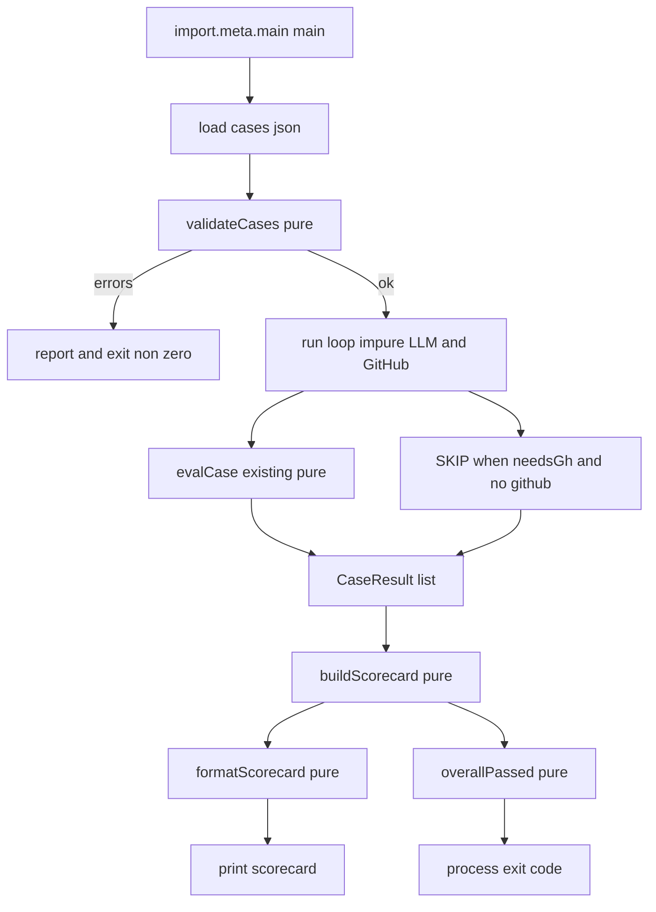
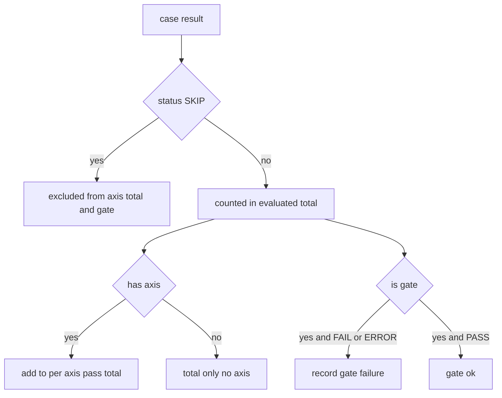

# Technical Design: eval-scorecard

## Overview

評価ハーネス `scripts/kb-eval.ts` を「総合 PASS/FAIL のみ」から「**評価軸ごとの到達度＋合否ゲート＋スコアカード**」を出力する測定基盤へ拡張する。本機能は採点の**枠組み（タグ／集計／ゲート／出力／終了コード）**のみを担い、各軸の採点ロジックの中身（出典必須・忠実性・次の一歩 = #29/#31）は所有しない。

**Users**: 評価基盤のメンテナが `bun run scripts/kb-eval.ts` を実行し、末尾のスコアカードで軸別到達度とゲート合否を一目で把握する。

**Impact**: 現状の総合採点ループに対し、(1) ケースへの任意 `axis` / `gate` タグ、(2) 純粋な集計・合否・整形関数、(3) `import.meta.main` ガードによるエントリ分離を追加する。本番コード `src/` は不変更。採点中核 `evalCase()`（純粋関数）は契約を維持したまま再利用する。副次効果として、SKIP を分母に含める既存の終了コード不整合を是正する。

### Goals
- ケースを評価軸（`A`/`B`/`C`/`D`/`safety`）でタグ付けし、軸別 pass/total を集計・出力する。
- 任意ケースを合否ゲート化し、ゲート FAIL を全体不合格＋非ゼロ終了に反映する。
- 1 回の実行末尾に「軸別集計＋ゲート合否＋総合」を含むスコアカードを表示する。
- 既存 7 ケースを無改修で全 PASS に保ち、新規外部依存ゼロ・typecheck クリーンを維持する。
- SKIP をゲート判定・軸別集計の双方から除外する。

### Non-Goals
- 新しい採点種別（出典必須・忠実性・次の一歩）の実装 — #29/#31 が所有。
- B′/D/safety などの実評価ケース群の追加 — 本機能はタグの**受け皿**のみを用意する。
- 本番コード `src/` の変更、新たな外部依存の追加。
- スコア軸への合格しきい値（tolerance）導入 — 現状は評価済み全 PASS が合格条件。ゲートはしきい値導入後も「ハード合否」であり続けられるよう、最初から独立した結果として表現する。

## Boundary Commitments

### This Spec Owns
- `Case` 型への任意フィールド `axis?` / `gate?` の追加と、その読込時バリデーション（不正軸の検出）。
- ケース結果（PASS/FAIL/SKIP/ERROR）から導く**スコアカード集計モデル**と、その合否判定・整形・終了コード決定。
- `scripts/kb-eval.ts` のエントリ実行を `import.meta.main` 配下に閉じる構造変更（純粋関数を test から import 可能にするため）。

### Out of Boundary
- 採点ロジック `evalCase()` の意味変更（契約維持。本機能は呼び出すのみ）。
- 各軸の採点種別の中身（#29/#31）。
- 実評価ケースの追加・既存 7 ケースの内容変更。
- `src/` 配下のいかなる変更、GitHub/LLM 呼び出しの挙動変更。

### Allowed Dependencies
- `src/` からの **import のみ**（`createLlm` / `openDb` / `search` / `loadGitHub` / `runAgent` / 各ツール / `buildSystem`）。これらは変更しない。
- Bun 標準（`node:fs`、`import.meta.main`）のみ。npm 依存の追加は不可。
- 新規テストは `test/kb-eval.test.ts` から `../scripts/kb-eval.ts` の**純粋関数のみ**を import する。

### Revalidation Triggers
- `Case` / `Expect` の契約形状の変更。
- スコアカードの出力フォーマット（軸別行・ゲート行・総合行のラベルや構造）の変更 → 後続 #29/#31 の出力前提に影響。
- 終了コード判定基準の変更 → CI 連携の前提に影響。
- 軸の許容集合（`A`/`B`/`C`/`D`/`safety`）の変更。

## Architecture

### Existing Architecture Analysis

`scripts/kb-eval.ts`（180 行・単一ファイル）は次の構造を持つ:
- 型 `Expect`(L22) / `Case`(L39) / `Call`(L45)。
- 純粋採点 `evalCase(expect, calls, answer): string[]`(L65)。**空配列＝PASS**。本機能の契約維持対象。
- トップレベル main 相当(L110-180): 読込 → `createLlm`/`openDb`/`loadGitHub` → ループ（`needsGh` で GitHub 未設定ケースを SKIP, L133-142）→ 逐次 `PASS/FAIL/SKIP/ERROR` 出力 → `=== passed/total PASS ===`(L179) → `process.exit(passed === cases.length ? 0 : 1)`(L180)。

維持すべき制約: `evalCase` 契約、`needsGh` の SKIP ロジック、`expect` 各フィールドの意味と「指定項目だけ検査」方針、相対 import＋`.ts` 拡張子。**既知の不整合**: 終了コードの分母が `cases.length`（SKIP 込み）のため、GitHub 未設定だと runnable 全 PASS でも非ゼロ終了になりうる。

### Architecture Pattern & Boundary Map

選定パターン: **副作用の縁（I/O・LLM・GitHub）と純粋なコア（バリデーション・集計・合否・整形）を分離**し、純粋コアを単体テスト可能にする（steering tech.md の「純粋関数化してテスト」方針に整合、`src/kb/prune.ts` の `computeFlags` と同型）。エントリ実行は `import.meta.main` 配下の `main()` に閉じる。



**Architecture Integration**:
- 既存パターン保持: ツールラップ（`recordTool`）による痕跡採点、`needsGh` SKIP、逐次行出力。
- 新規コンポーネント根拠: 集計/合否/整形/バリデーションを純粋関数化することでテスト可能化と責務分離を同時に満たす。
- Steering compliance: `src/` 不変更、neutral layer 非依存、純粋関数テスト、`any` 不使用。

### Technology Stack

| Layer | Choice / Version | Role in Feature | Notes |
|-------|------------------|-----------------|-------|
| CLI / Script | Bun 1.3.x（既存） | エントリ実行・`import.meta.main` でテスト時抑止 | 直接実行時 `true` を確認済み |
| Backend / Logic | TypeScript strict（既存） | 純粋関数（検証・集計・合否・整形） | 新規依存なし（Req 4.3） |
| Test | `bun test`（既存） | 純粋関数の単体テスト | `test/` から `scripts/` を import する初の前例 |
| Data | JSON ケースファイル（既存） | `axis?`/`gate?` を任意追加 | 既存 7 ケースは無タグのまま（Req 4.1） |

新規依存なし。`test/` → `scripts/` の import は tsconfig が `scripts` を include 済みで解決可能。

## File Structure Plan

### Modified Files
- `scripts/kb-eval.ts` — 中核。以下を追加・変更（`evalCase` 本体は不変）:
  - `Axis` 型・`AXES` 定数、`Case` に `axis?: Axis` / `gate?: boolean` を追加。
  - 純粋関数 `validateCases` / `buildScorecard` / `overallPassed` / `formatScorecard` を追加。
  - 結果モデル `CaseResult` / `CaseStatus` / `Scorecard` 型を追加。
  - トップレベル main 相当を `async function main()` に括り出し、末尾を `if (import.meta.main) await main();` に変更。実 LLM/GitHub 呼び出し（`createLlm` 等）は `main()` 内に閉じる。
  - ループは各ケースの `CaseResult` を構築 → `buildScorecard` → `formatScorecard` 出力 → `overallPassed` で `process.exit`。
  - ヘッダコメントに `axis`/`gate` の使い方を追記（発見容易性）。

### New Files
- `test/kb-eval.test.ts` — 純粋関数の単体テスト（`../scripts/kb-eval.ts` から import）。LLM/GitHub には一切触れない。

### Optional Documentation Update
- `eval/cases.sample.json` — `axis`/`gate` の記述例を追加（任意・ドキュメント目的）。**`eval/cases.json` は変更しない**（Req 4.1）。

> `evalCase` / `recordTool` / `needsGh` ロジックは現状のまま。新規純粋関数群は `evalCase` の下、main の上に配置する。

## System Flows

スコアカード判定の分岐（ゲートと SKIP の扱い）:



判定規則:
- **評価済み（非 SKIP）** のみを軸別 pass/total・ゲート・総合分母に数える（Req 5.2/5.3）。
- 全体合否 = 評価済みに FAIL/ERROR が無い **かつ** ゲート FAIL が無い → 終了コード 0（Req 2.2/2.4/5.2）。現状スコープではゲート FAIL は評価済み FAIL の部分集合だが、将来スコア軸にしきい値が入っても**ゲートはハード合否**であり続けるよう独立条件として明示する。

## Requirements Traceability

| Requirement | Summary | Components | Interfaces | Flows |
|-------------|---------|------------|------------|-------|
| 1.1 | 軸別 pass/total 集計 | EvalScorecard | `buildScorecard` | スコアカード判定 |
| 1.2 | 全軸の軸別 pass/total 出力 | EvalScorecard | `formatScorecard` | スコアカード判定 |
| 1.3 | 無タグは総合のみ・軸別に含めない | EvalScorecard | `buildScorecard` | スコアカード判定 |
| 1.4 | 不正軸を検出しエラー報告 | CaseValidation | `validateCases` | 実行パイプライン |
| 2.1 | ゲートケースとして扱う | EvalScorecard | `Case.gate` / `buildScorecard` | スコアカード判定 |
| 2.2 | ゲート FAIL→全体不合格＋非ゼロ終了 | EvalScorecard | `overallPassed` | スコアカード判定 |
| 2.3 | ゲート FAIL をスコア FAIL と区別出力 | EvalScorecard | `formatScorecard` / 逐次行 | 実行パイプライン |
| 2.4 | 全ゲート PASS 時はスコア軸で判定 | EvalScorecard | `overallPassed` | スコアカード判定 |
| 3.1 | 軸別＋ゲート＋総合のスコアカード末尾表示 | EvalScorecard | `formatScorecard` | 実行パイプライン |
| 3.2 | 混在を 1 実行で出力 | EvalScorecard | `buildScorecard` | 実行パイプライン |
| 3.3 | 既存の総合 PASS 数を保持 | EvalScorecard | `formatScorecard` | 実行パイプライン |
| 4.1 | 既存 7 ケース無改修で全 PASS | （非変更制約） | `evalCase`（不変） | 実行パイプライン |
| 4.2 | `expect` 意味・指定項目だけ検査を不変 | （非変更制約） | `evalCase`（不変） | — |
| 4.3 | 新規外部依存なし | （制約） | — | — |
| 4.4 | typecheck クリーン | （制約） | 全型定義 | — |
| 5.1 | GitHub 未設定で SKIP 維持 | 実行ループ | `needsGh`（不変） | 実行パイプライン |
| 5.2 | SKIP をゲート判定から除外 | EvalScorecard | `buildScorecard` | スコアカード判定 |
| 5.3 | SKIP を軸別 pass/total から除外 | EvalScorecard | `buildScorecard` | スコアカード判定 |

## Components and Interfaces

| Component | Domain/Layer | Intent | Req Coverage | Key Dependencies | Contracts |
|-----------|--------------|--------|--------------|------------------|-----------|
| CaseValidation | Pure core | 読込ケースの軸を検証し不正軸を報告 | 1.4 | なし | Service |
| EvalScorecard | Pure core | 結果から軸別・ゲート・総合を集計し合否・整形を導く | 1.1–1.3, 2.1–2.4, 3.1–3.3, 5.2–5.3 | `CaseResult`（入力） | Service / State |
| RunLoop | Impure orchestration | LLM/GitHub 実行から `CaseResult` を構築（既存ループの拡張） | 4.1, 5.1 | `evalCase`, `needsGh`, `runAgent` ほか（P0） | — |

### Pure Core

#### CaseValidation

| Field | Detail |
|-------|--------|
| Intent | 読込直後にケースの `axis` 値を検証し、許容集合外を不正として収集する |
| Requirements | 1.4 |

**Responsibilities & Constraints**
- **生パース形状 `RawCase[]`**（`axis?: string` / `gate?: unknown`）に対して検証する。`JSON.parse` のキャストでは不正値が素通りするため、narrow 前に検証して**型と実行時のギャップを塞ぐ**（検証を型論理的に有効化）。
- 各 `axis`（存在する場合）が `AXES` の要素であることを検証。非該当は不正として収集（Req 1.4）。
- `gate` は省略時 `false` 扱い。boolean 以外は不正として報告（防御的・最小）。
- 副作用なし。エラー文字列の配列を返すのみ（呼び出し側が出力＆非ゼロ終了を決定）。
- 検証成功後、呼び出し側が `RawCase[]` を `Case[]` へ narrow する。

**Contracts**: Service [x]

##### Service Interface
```typescript
type Axis = "A" | "B" | "C" | "D" | "safety";
const AXES = ["A", "B", "C", "D", "safety"] as const;

/** JSON 直後の緩い形状。axis/gate は未検証なので Axis に narrow しない。 */
interface RawCase {
  name: string;
  question: string;
  expect: Expect;
  axis?: string;    // 未検証。validateCases 通過後に Axis へ narrow
  gate?: unknown;   // 未検証。boolean 以外は不正
}

/** 検証済みケース。axis は有効な Axis、gate は boolean に確定。 */
interface Case {
  name: string;
  question: string;
  expect: Expect;
  axis?: Axis;     // 省略時は無タグ（総合のみに数える）
  gate?: boolean;  // 省略時は false
}

/** 不正な axis/gate を持つケースのエラー文を返す。空配列なら検証成功。 */
function validateCases(cases: RawCase[]): string[];
```
- Preconditions: `cases` は `JSON.parse` 直後の `RawCase[]`（narrow 前）。
- Postconditions: 戻り値が空なら呼び出し側は安全に `Case[]` へ narrow できる。空でなければ内容を出力し非ゼロ終了する（Req 1.4: 黙って集計しない）。
- Invariants: 入力を変更しない。

#### EvalScorecard

| Field | Detail |
|-------|--------|
| Intent | ケース結果からスコアカードを集計し、合否判定と整形を提供する |
| Requirements | 1.1, 1.2, 1.3, 2.1, 2.2, 2.3, 2.4, 3.1, 3.2, 3.3, 5.2, 5.3 |

**Responsibilities & Constraints**
- **評価済み（非 SKIP）** のケースのみを軸別 pass/total・ゲート・総合分母に集計（Req 5.2/5.3）。
- 無タグケースは軸別集計に含めず総合のみに数える（Req 1.3）。
- **`axis` と `gate` は直交フラグ**。1ケースが両方を持つ場合（例: `axis:"safety"` かつ `gate:true`）は、当該軸の tally とゲート母数の**双方に計上**する（軸別到達度とハード合否は別軸の関心事のため）。
- ゲートケースの FAIL/ERROR を独立に記録（Req 2.1/2.3）。
- 全体合否を「評価済み全 PASS かつ ゲート FAIL なし」で導く（Req 2.2/2.4）。
- 整形は既存の総合 PASS 数を保持しつつ軸別行・ゲート行を追加（Req 3.1/3.3）。
- 全関数副作用なし（純粋）。

**Contracts**: Service [x] / State [x]

##### State Management
```typescript
type CaseStatus = "PASS" | "FAIL" | "SKIP" | "ERROR";

interface CaseResult {
  name: string;
  axis?: Axis;
  gate: boolean;
  status: CaseStatus;
  fails: string[]; // FAIL の内訳（PASS/SKIP は空）
}

interface AxisTally { axis: Axis; pass: number; total: number; }

interface Scorecard {
  perAxis: AxisTally[]; // 出現した軸のみ・SKIP を除外して集計
  gate: { failed: string[]; total: number }; // 評価済みゲートのうち FAIL/ERROR の名前と母数
  total: { pass: number; evaluated: number; skipped: number };
}
```
- State model: `Scorecard` は `CaseResult[]` から一意に導かれる派生状態（永続化なし）。
- Consistency: `total.evaluated = perAxis 非依存の非 SKIP 件数`、`skipped` は別カウント。`perAxis[*].total ≤ evaluated`。

##### Service Interface
```typescript
/** 結果列からスコアカードを集計する（純粋）。SKIP は軸別・ゲート・evaluated から除外。 */
function buildScorecard(results: CaseResult[]): Scorecard;

/** 全体合否（true=合格）。評価済み全 PASS かつ gate FAIL なし。 */
function overallPassed(sc: Scorecard): boolean;

/** スコアカードの末尾表示文字列（軸別行＋ゲート行＋総合行）。 */
function formatScorecard(sc: Scorecard): string;
```
- Preconditions: `results` は実行ループが各ケースにつき 1 件構築。
- Postconditions:
  - `overallPassed` が `false` のとき呼び出し側は非ゼロ終了する（Req 2.2）。
  - `formatScorecard` の出力は総合 PASS 数（`total.pass`）を含む（Req 3.3）。
- Invariants: 入力を変更しない。SKIP は `perAxis`・`gate`・`evaluated` のいずれにも数えない（Req 5.2/5.3）。

### Impure Orchestration

#### RunLoop（既存ループの拡張）

| Field | Detail |
|-------|--------|
| Intent | 各ケースを SKIP 判定／実行し、`evalCase` の結果を `CaseResult` に写像する |
| Requirements | 4.1, 5.1 |

**Responsibilities & Constraints**
- `needsGh && !github` のとき `status: "SKIP"`（既存ロジック不変、Req 5.1）。
- 実行成功時は `evalCase` の返り値長で `PASS`/`FAIL` を決定、例外時は `ERROR`。
- 逐次行出力でゲート FAIL を `FAIL` と区別可能に表示（例: `FAIL* (gate)`）（Req 2.3）。
- 全ケース処理後に `buildScorecard` → `formatScorecard` 出力 → `overallPassed` で `process.exit`。

**Dependencies**
- Outbound（変更しない／import のみ）: `evalCase`, `recordTool`, `needsGh` 相当ロジック, `runAgent`, `search`, `buildSystem`, `createLlm`, `openDb`, `loadGitHub`（P0）。

**Implementation Notes**
- Integration: 既存の逐次 `PASS/FAIL/SKIP/ERROR` 行はそのまま維持し、末尾にスコアカードを**追加**（既存出力を壊さない、Req 3.3）。スコアカードの総合行は**評価済み基準で明示**する（例 `総合 5/5 PASS, 2 SKIP`）。既存の `passed/cases.length` 行を残す場合は「（参考）」と区別し、表示と終了コード（SKIP 除外）の食い違いによる誤読を防ぐ（Req 3.3 と 5.2/5.3 の境界）。
- Validation: `main()` 冒頭で `validateCases` を呼び、非空なら出力して非ゼロ終了（Req 1.4）。
- Risks: `import.meta.main` ガード漏れでテスト import 時に LLM/GitHub が走る → ガードを必須チェック項目に。

## Error Handling

### Error Strategy
- **不正軸（Req 1.4）**: `validateCases` がエラー文を収集 → `main()` が全件出力し `process.exit(1)`（fail fast、黙って集計しない）。
- **ケース読込失敗**: 既存の `try/catch` を維持（`process.exit(1)`、サンプル参照を案内）。
- **ケース実行例外**: `ERROR` ステータスとして記録し、評価済みに数える（→ 全体不合格に寄与）。スコアカードと非ゼロ終了に反映。
- **SKIP**: エラーではない。合否・集計から除外（Req 5.2/5.3）。

### Monitoring
- 逐次行（`PASS/FAIL*(gate)/SKIP/ERROR`）＋末尾スコアカードが唯一の可観測出力。追加のロギング基盤は導入しない。

## Testing Strategy

### Unit Tests（`test/kb-eval.test.ts`、純粋関数）
- `validateCases`: 不正軸（例 `"X"`）を検出してエラーを返す／有効軸・無タグはエラー無し（Req 1.4, 1.1, 1.3）。
- `buildScorecard`: 軸別 pass/total を正しく集計し、SKIP を軸別・evaluated から除外、無タグを軸別に含めない（Req 1.1, 1.2, 1.3, 5.3）。
- `buildScorecard`: ゲート FAIL/ERROR を `gate.failed` に記録し、SKIP のゲートを除外（Req 2.1, 5.2）。
- `overallPassed`: ゲート FAIL で `false`／全ゲート PASS かつスコア全 PASS で `true`／runnable 全 PASS＋一部 SKIP で `true`（既存 SKIP→非ゼロ不整合の是正、Req 2.2, 2.4, 5.2）。
- `formatScorecard`: 出力に軸別行・ゲート行・総合 PASS 数を含む（Req 3.1, 3.2, 3.3）。

### Integration / Regression（手動・標準コマンド）
- GitHub 未設定で既存 7 ケースを無改修実行 → 5 PASS / 2 SKIP・終了コード 0（Req 4.1, 5.1, 5.2）。
- `bun run typecheck` がエラーなく完了（Req 4.4）。
- 依存追加が無いこと（`package.json` 差分なし、Req 4.3）。

## Security Considerations
- 本機能はローカル実行スクリプトの集計・整形のみ。秘密情報・認証は扱わない（既存の LLM/GitHub 認証経路は不変）。新たな攻撃面なし。
