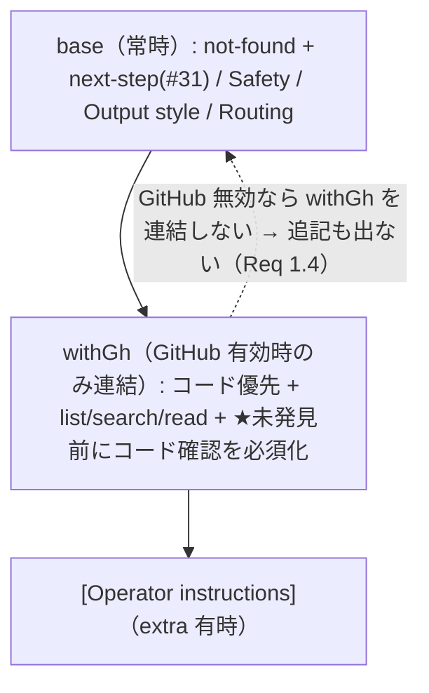

# Design Document: reduce-dead-ends

## Overview

**Purpose**: GitHub 有効時、kb-bot が実装・挙動・仕様・コスト系の質問で「見つからない」と宣言する前に**実コードの確認を必須化**し、docs に無くてもコードから答えて行き止まらないようにする。

**Users**: 非エンジニアの利用者が、ドキュメント未整備の質問でも「見つからない」で突き放されずコード由来の答えを得る。

**Impact**: 変更は `src/chat/core.ts` の `buildSystem` の**プロンプト文言のみ**。GitHub 有効時に付与される `withGh` ブロックに「"見つからない" と結論する前にコードを確認せよ」という 1 文を足す。`base`（GitHub 無効でも常に付く部分）の not-found 文（#31 の next-step 同居）は不変＝GitHub 無効時は挙動が変わらない（Req 1.4）。キャッシュ・エスカレーション・retrieval は一切触らない。

### Goals
- GitHub 有効時、実装・挙動・仕様・コスト系の質問で not-found を宣言する前に実コード（search_repo_code / read_repo_file）を確認させる。
- docs にもコードにも無いときだけ「見つからない＋次の一歩（#31）」を返す。
- [Safety]／[Output style]／#31 next-step／出力言語自動判別／docs 優先ルーティングを不変に保つ。

### Non-Goals
- 未発見/諦め回答の非キャッシュ化（関連性スコアに依存 → A経路スコア化 follow-on スペックが所有）。
- A経路スコア化エスカレーション・retrieval 関連性・基本モデル底上げ。
- eval ハーネス／新規 eval ケース（`eval-*` 各スペック所有。効果測定は既存 B′/D）。

## Boundary Commitments

### This Spec Owns
- `src/chat/core.ts` `buildSystem` の `withGh` ブロックへの「未発見宣言前のコード確認必須化」1 文追記。
- そのプロンプト文言の決定的テスト（`test/systemPrompt.test.ts`）。

### Out of Boundary
- `base` 文字列の not-found 文／next-step（#31 / eval-next-step が所有・保持のみ）。
- 回答キャッシュ（`src/cache.ts`・`core.ts` の保存条件）＝ follow-on スペックが所有。
- 昇格トリガ（`startHard`/truncated）・retrieval 関連性（`dropWeakHits`）・モデル設定。
- eval ハーネスの判定ロジック。

### Allowed Dependencies
- `src/chat/core.ts` の `buildSystem`（`withGh` ブロック文字列のみ）。
- 既存のコード参照ツール名（list_repo_tree / search_repo_code / read_repo_file）は文言中で参照するのみ（挙動は変えない）。

### Revalidation Triggers
- `buildSystem` の `withGh`/`base` 文言構成を変える場合 → `systemPrompt.test` と、#31 next-step・#30 drift の前提の再確認。
- コード参照ツール名・API が変わる場合 → 文言の整合確認。

## Architecture

### Existing Architecture Analysis

`buildSystem(gh?, extra?)` は 3 段の文字列合成: `base`（常時）→ `withGh`（GitHub 有効時のみ `base` に連結）→ `[Operator instructions]`（extra 有時）。
- not-found 指示は `base`（L29）にあり、#31 の next-step 文が同居。GitHub 有無に関わらず出る。
- `withGh` ブロック（L38-39）は既に「ACTUAL CODE を source of truth とみなす／list_repo_tree・search_repo_code・read_repo_file で調べて path:line を引用／docs とコードが食い違えばコード優先」を指示。しかし**「not-found 宣言前にコードを確認する」ことの必須化は無い**。

本設計はこの `withGh` ブロックに 1 文を足す**追記型**。合成順・シグネチャ・base・operator ブロックは不変。

### Architecture Pattern & Boundary Map

**Selected pattern**: `withGh` ブロックへの最小プロンプト追記（GitHub 有効時のみ発火＝Req 1.4 を構造で保証）。

**Key decisions**:
- 追記先を `base` ではなく `withGh` にする。理由: 「コードを確認せよ」は参照すべきコード（GitHub）がある時のみ意味を持つ。`withGh` に置けば GitHub 無効時は自動的に出ず、Req 1.4（無効時は従来どおり）を**文言分岐でなく構造**で満たす。
- 「常にコードを検索せよ」ではなく「**実装・挙動・仕様・コスト系で、docs で答えられない場合に、not-found と結論する前に**コードを確認せよ」と条件付けする。docs で足りる質問（手順・ルール）に不要なコード探索を強制しない（Req 1.3・既存 [Routing] と整合）。
- `base` の not-found 文と next-step は保持し、「docs とコードの**両方**で見つからないときだけ not-found」と結ぶ（Req 1.2）。

### Technology Stack

| Layer | Choice / Version | Role in Feature | Notes |
|-------|------------------|-----------------|-------|
| 本番 | TypeScript on Bun (`src/chat/core.ts`) | `withGh` への 1 文追記 | 文字列テンプレの変更のみ・新規依存なし |
| Test | `bun test`（`test/systemPrompt.test.ts`） | 追記の存在／無効時の非出現／既存文言保持を検証 | 資格情報不要 |

## File Structure Plan

### Modified Files
- `src/chat/core.ts` —
  - `buildSystem` の `withGh` ブロック文字列に「未発見宣言前のコード確認必須化」の 1 文を追記する。実装・挙動・仕様・コスト系で docs だけでは答えられない場合、`search_repo_code`/`read_repo_file` で実コードを確認し、docs とコードの**両方**に無いと確認できて初めて not-found を述べる旨。`base`／合成順／シグネチャは不変。
- `test/systemPrompt.test.ts` —
  - GitHub 有効時の出力に「未発見前のコード確認」を促す文言が含まれることを検証。
  - GitHub 無効時（`buildSystem()`）の出力には当該文言が**含まれない**ことを検証（Req 1.4）。
  - 既存キーフレーズ（[Safety] の "REFERENCE MATERIAL"、[Output style] の "conclusion first"、#31 の "next step"、言語自動判別の "SAME language"）が保持されることを検証（Req 1.5）。

各ファイル単一責務: `core.ts`=本番プロンプト、`systemPrompt.test.ts`=回帰検証。

## Requirements Traceability

| Requirement | Summary | Components | Interfaces | Flows |
|-------------|---------|------------|------------|-------|
| 1.1 | 未発見前にコード確認（GitHub 有効） | `buildSystem`(withGh) | withGh 文言追記 | system 生成 |
| 1.2 | 両方に無い時だけ not-found + next-step | `buildSystem` | withGh 追記 + base 既存文 | — |
| 1.3 | docs で足りれば強制しない | `buildSystem` | 条件付き文言（実装/挙動系に限定） | 既存 [Routing] 保持 |
| 1.4 | GitHub 無効時は不適用 | `buildSystem`(base only) | withGh 未連結で追記も出ない | 構造分岐 |
| 1.5 | Safety/Output/next-step/言語 不変 | `buildSystem` | base 無改変・withGh のみ追加 | — |
| 2.1 | typecheck クリーン | `buildSystem` | 文字列変更のみ | `bun run typecheck` |
| 2.2 | 既存テスト維持 | `systemPrompt.test` | 追加のみ | `bun test` |
| 2.3 | キャッシュ不変 | （非変更） | cache.ts/保存条件を触らない | — |
| 2.4 | エスカレーション/モデル不変 | （非変更） | startHard/retrieval を触らない | — |
| 2.5 | buildSystem 以外の src 不変 | `buildSystem` のみ | — | — |

## Components and Interfaces

| Component | Domain/Layer | Intent | Req Coverage | Key Dependencies | Contracts |
|-----------|--------------|--------|--------------|------------------|-----------|
| `buildSystem`（withGh 追記） | 本番プロンプト | 未発見宣言前のコード確認を必須化 | 1.1–1.5, 2.5 | `src/chat/core.ts`（P0） | State（文字列） |

### buildSystem（withGh 追記）

| Field | Detail |
|-------|--------|
| Intent | GitHub 有効時のみ、not-found 宣言前のコード確認を促す 1 文を `withGh` に連結 |
| Requirements | 1.1, 1.2, 1.3, 1.4, 1.5, 2.5 |

**Responsibilities & Constraints**
- 追記は `withGh` ブロック内に閉じる。`base`（not-found 文・next-step・Safety・Output style・Routing・Audience・言語行）は無改変。
- 文言は条件付き: 「実装・挙動・仕様・コスト系の質問で docs だけでは答えられない場合、not-found と結論する前に search_repo_code/read_repo_file で実コードを確認し、docs とコードの両方に無いと確認できたときのみ not-found を述べよ」。
- `[Operator instructions]` 連結・関数シグネチャ・戻り値・呼び出し側は不変。

**Implementation Notes**
- Integration: `withGh` のテンプレートリテラルに 1 文追加するのみ。
- Validation: `systemPrompt.test.ts` で「有効時に含む／無効時に含まない／既存文言保持」を検査。
- Risks: 弱いモデルは指示に常時従うとは限らない（ライブ挙動は非決定）。本設計はプロンプトの決定的な内容を保証するに留め、モデル追従率の底上げは A経路スコア化・モデル設定 follow-on の領域。効果測定は既存 eval（B′ drift #30 等）。

## Error Handling

新たなエラー経路なし。`buildSystem` は文字列を返すのみ。

## Testing Strategy

### Unit Tests（`test/systemPrompt.test.ts`, `bun test`・資格情報不要）
1. GitHub 有効（`buildSystem(gh)`）の出力に「未発見前のコード確認」を促す文言が含まれる（Req 1.1/1.2）。
2. GitHub 無効（`buildSystem()`）の出力に当該文言が含まれない（Req 1.4）。
3. GitHub 有効出力に既存の [Safety]/[Output style]/#31 next-step/言語自動判別のキーフレーズが保持される（Req 1.5）。
4. 既存の `buildSystem` 系テスト（GitHub コード優先追記・extra 連結・言語）が無改修で PASS（Req 2.2）。

### ライブ実行での実証（`bun run kb:eval`, 手動・課金あり・非決定）
5. 既存の code / B′ drift ケースで、docs に無い挙動質問がコードを確認して答えることを確認（本仕様は新規ケースを追加せず既存で観測）。typecheck クリーン（Req 2.1）。
