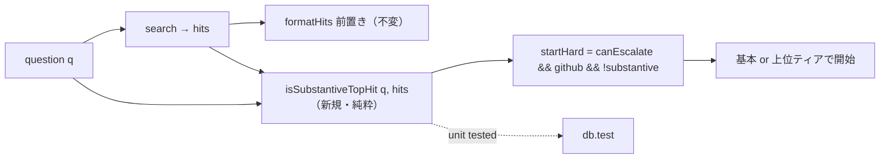

# Design Document: relevance-aware-escalation

## Overview

**Purpose**: 「実質空振り（最上位ヒットが質問に実質無関係）」をコーパス非依存に検知し、A経路事前昇格（`startHard`）を「FTS 空 **または** 実質空振り」で発火させる。無関係ヒット1件で昇格が発火しない現状（`dropWeakHits` が最上位を無条件保持）を是正し、難質問を最初から上位ティアで走らせる。

**Users**: 非エンジニア利用者が、docs 未整備の難質問でも上位ティア＋#39 のコード確認で正答に届く。

**Impact**: `src/kb/db.ts` に純粋関数の関連性シグナル（クエリ内容語カバレッジ）を追加し、`src/chat/core.ts` の `startHard` 判定式を差し替える（1 行）。初期コンテキスト前置き（`formatHits`）・`dropWeakHits`・`buildSystem`・B経路・フォールバック・キャッシュ・eval は不変。`canEscalate` 偽（`KB_MODEL_HARD` 未設定）なら従来どおり昇格しない。

### Goals
- クエリ内容語カバレッジで「実質空振り」を判定する純粋関数を追加（生 bm25 絶対しきい値に非依存）。
- `startHard` を「空 or 実質空振り」で発火させ、docs に無い難質問を上位ティアで開始。
- 検索結果の提示・ルーティング・既存の昇格/フォールバック挙動を不変に保つ。

### Non-Goals
- 諦め回答の非キャッシュ化（別 follow-on）／基本モデル底上げ（`.env`）。
- `dropWeakHits`・`formatHits`・`buildSystem`・B経路・`runAgentWithFallback` の変更。
- 意味的関連性の埋め込み判定（コーパス非依存の語カバレッジに限定）。

## Boundary Commitments

### This Spec Owns
- `src/kb/db.ts` のクエリ内容語カバレッジ関連の純粋関数（`queryCoverage` / `isSubstantiveTopHit` 等）と検出しきい値の定義。
- `src/chat/core.ts` の `startHard` 判定式の差し替え（関連性シグナル使用）。
- 上記の決定的テスト（`test/db.test.ts` 等）。

### Out of Boundary
- `dropWeakHits`（枝刈り）・`formatHits`（前置き）・`search` の返却契約（`SearchHit[]`）は不変。
- 回答キャッシュ（`cache.ts`・保存条件）／`buildSystem`／eval 判定ロジック。
- B経路 `truncated` 救済・`runAgentWithFallback`・モデル設定・`canEscalate` の定義。

### Allowed Dependencies
- `src/kb/segment.ts` の `queryTerms` / `indexTokens`（既存トークナイザ）を関連性判定に再利用。
- `src/chat/core.ts` 内の既存変数（`hits`, `q`, `canEscalate`, `github`）。

### Revalidation Triggers
- カバレッジしきい値や関連性関数のシグネチャを変える場合 → 単体テストと `startHard` の再確認。
- `queryTerms`/`indexTokens` のトークン化仕様が変わる場合 → カバレッジ計算の再確認。
- `search`/`dropWeakHits` の返却契約が変わる場合 → 本シグナルの入力前提の再確認。

## Architecture

### Existing Architecture Analysis

- `answer()`（`src/chat/core.ts`）は `hits = search(db, q, TOP_K)` を初期コンテキストに前置きし、`startHard = canEscalate && !!github && hits.length === 0`（L202）で事前昇格を決める。
- `search`（`src/kb/db.ts`）は bm25 順の `SearchHit[]` を返し、`dropWeakHits` が**最上位を無条件保持**（L93 `i===0`）。`buildMatchQuery` は `queryTerms`（`segment.ts`）で内容語を抽出し OR 一致。
- 帰結: 無関係な内容語1件の一致でも top hit が残り `hits.length>=1` → `startHard` が発火しない。

本設計は「最上位ヒットが質問の内容語をどれだけ含むか（カバレッジ）」という**コーパス非依存**シグナルを新設し、`startHard` の `hits.length===0` を「空 or カバレッジ不足」に置換する。検索の返却・前置き・枝刈りは触らない。

### Architecture Pattern & Boundary Map

**Selected pattern**: 純粋関数の関連性シグナル追加（`buildScorecard`/`citationFails` と同じ「副作用なし・export・`bun test`」）＋ `startHard` 判定式の差し替え。



**Key decisions**:
- 関連性指標に **クエリ内容語カバレッジ** を採用（生 bm25 絶対値に非依存＝コーパス非依存, Req 1.3）。`queryTerms(q)` の distinct 内容語のうち、最上位ヒット本文のトークン列（`indexTokens`）に含まれる割合。
- しきい値は名前付き定数（既定 0.5）。理由: FTS の OR 一致は「最低 1 語一致」を保証するため単純な「1 語以上」は無意味。半数以上の内容語を含めば実質関連とみなす。単一内容語クエリ（分母1）は一致で 1.0＝関連扱い（＝従来どおり昇格しない・非回帰）。
- 関連性シグナルは**昇格判定にのみ**使用。`search` の戻り値・`formatHits`・`dropWeakHits` は不変（Req 2.1）。
- `canEscalate` 偽なら `startHard` は常に偽（式の既存項で担保）＝非回帰（Req 1.4）。

### Technology Stack

| Layer | Choice / Version | Role | Notes |
|-------|------------------|------|-------|
| 検索/判定 | TypeScript on Bun (`src/kb/db.ts`) | `queryCoverage`/`isSubstantiveTopHit` 純粋関数 | 既存 `queryTerms`/`indexTokens` を再利用・新規依存なし |
| 昇格 | TypeScript on Bun (`src/chat/core.ts`) | `startHard` 判定式の差し替え | 1 行・既存項（canEscalate/github）保持 |
| Test | `bun test`（`test/db.test.ts`） | カバレッジ/実質関連の単体検証 | 資格情報不要 |

## File Structure Plan

### Modified Files
- `src/kb/db.ts` —
  - `export function queryCoverage(query: string, text: string): number` を追加（`queryTerms` の distinct 内容語のうち `indexTokens(text)` のトークン列に含まれる割合。分母0 は 0）。
  - `export function isSubstantiveTopHit(query: string, hits: SearchHit[], minCoverage = REL_MIN_COVERAGE): boolean` を追加（`hits` 空なら false、そうでなければ最上位ヒットのカバレッジ ≥ しきい値）。
  - しきい値定数 `REL_MIN_COVERAGE = 0.5`（コメントで根拠）。
- `src/chat/core.ts` —
  - `startHard` を `canEscalate && !!github && !isSubstantiveTopHit(q, hits)` に差し替え（`isSubstantiveTopHit` を import）。空振り（hits 空）は `isSubstantiveTopHit` が false を返すため従来の `hits.length===0` を包含する。
- `test/db.test.ts` —
  - `queryCoverage`/`isSubstantiveTopHit` の単体テストを追加（関連ヒットで true、無関係ヒット/空で false、単一内容語の扱い、入力不変）。

各ファイル単一責務: `db.ts`=検索と関連性判定、`core.ts`=昇格トリガ、`db.test.ts`=回帰検証。

## Requirements Traceability

| Requirement | Summary | Components | Interfaces | Flows |
|-------------|---------|------------|------------|-------|
| 1.1 | 空 or 実質空振りで事前昇格 | `isSubstantiveTopHit`, `startHard` | `startHard` 判定式 | 昇格開始 |
| 1.2 | 実質関連なら基本ティア | `isSubstantiveTopHit` | coverage ≥ しきい値 → substantive | 基本ティア |
| 1.3 | コーパス非依存指標 | `queryCoverage` | 内容語カバレッジ（bm25 非依存） | — |
| 1.4 | 昇格不可なら従来挙動 | `startHard` | 既存 `canEscalate` 項 | — |
| 1.5 | 純粋関数で単体検証可 | `queryCoverage`/`isSubstantiveTopHit` | 副作用なし | `bun test` |
| 2.1 | 提示/枝刈りは不変 | （非変更） | `formatHits`/`dropWeakHits`/`search` 契約保持 | 前置き |
| 2.2 | docs 十分なら基本ティア | `isSubstantiveTopHit` | 関連 top hit → substantive | docs ルーティング |
| 2.3 | B経路/フォールバック不変 | （非変更） | truncated 救済/`runAgentWithFallback` | — |
| 3.1 | typecheck クリーン | 追加関数/式 | — | `bun run typecheck` |
| 3.2 | 既存テスト維持 | `db.test` | 追加のみ | `bun test` |
| 3.3 | cache/buildSystem/eval 不変 | （非変更） | — | — |
| 3.4 | 変更は db.ts/core.ts 限定 | 2 ファイル | — | — |

## Components and Interfaces

| Component | Domain/Layer | Intent | Req Coverage | Key Dependencies | Contracts |
|-----------|--------------|--------|--------------|------------------|-----------|
| `queryCoverage` | 検索（純粋関数） | クエリ内容語カバレッジを 0..1 で返す | 1.3, 1.5 | `queryTerms`/`indexTokens`（P0） | Service（純粋） |
| `isSubstantiveTopHit` | 検索（純粋関数） | 最上位ヒットが実質関連かを判定 | 1.1, 1.2, 1.5 | `queryCoverage`（P0） | Service（純粋） |
| `startHard`（差し替え） | 昇格トリガ | 空 or 実質空振りで上位ティア開始 | 1.1, 1.4, 3.4 | `isSubstantiveTopHit`（P0） | State（bool） |

### 検索層

#### queryCoverage / isSubstantiveTopHit

| Field | Detail |
|-------|--------|
| Intent | クエリ内容語カバレッジで最上位ヒットの実質関連を判定する純粋関数 |
| Requirements | 1.1, 1.2, 1.3, 1.5 |

**Responsibilities & Constraints**
- `queryCoverage(query, text)`: `queryTerms(query)` の distinct 内容語集合 T について、`indexTokens(text)` を空白区切りトークン集合に直し、T のうち含まれる割合を返す。`T` が空なら 0。
- `isSubstantiveTopHit(query, hits, minCoverage=0.5)`: `hits` が空なら false。そうでなければ `queryCoverage(query, hits[0].text) >= minCoverage`。
- 副作用なし・入力不変。ネットワーク/IO なし。

**Service Interface**
```typescript
export function queryCoverage(query: string, text: string): number;      // 0..1
export function isSubstantiveTopHit(query: string, hits: SearchHit[], minCoverage?: number): boolean;
```
- **Preconditions**: `hits` は `search` の戻り（bm25 降順）。
- **Postconditions**: `isSubstantiveTopHit` は空 hits で必ず false（＝従来の `hits.length===0` を包含）。
- **Invariants**: 引数を変更しない。

**Implementation Notes**
- Integration: `core.ts` の `startHard` を `canEscalate && !!github && !isSubstantiveTopHit(q, hits)` に置換するのみ。他の昇格/フォールバック分岐は不変。
- Validation: 単一内容語クエリは分母1で一致時 1.0＝substantive（従来どおり非昇格）。多語クエリで無関係ヒットは低カバレッジ→非 substantive→昇格。
- Risks: しきい値 0.5 はヒューリスティック。過剰昇格（コスト増）/過小昇格の余地があるため定数化し、単体テストで代表ケースを固定。埋め込み等の意味判定は Non-Goal。

## Error Handling
新たなエラー経路なし。純粋関数は例外を投げず数値/真偽を返す。`startHard` は既存の bool 合成。

## Testing Strategy

### Unit Tests（`test/db.test.ts`, `bun test`・資格情報不要）
1. `queryCoverage`: 多語クエリで、全内容語を含む本文 → 1.0 近傍（≥しきい値）。
2. `queryCoverage`: 多語クエリで、1 語しか含まない無関係本文 → 低い値（<しきい値）。
3. `isSubstantiveTopHit`: 空 `hits` → false（従来の空振りを包含, Req 1.1）。
4. `isSubstantiveTopHit`: 関連 top hit → true（Req 1.2）／無関係 top hit → false（Req 1.1）。
5. 入力不変（純粋・Invariant）。

### ライブ実行での実証（`bun run kb:eval` ほか, 手動・課金あり・非決定）
6. `KB_MODEL_HARD` 設定時、docs に無い難質問（B′ code/drift 系）が上位ティアで開始しコード探索を完走する傾向を確認（新規 eval ケースは追加しない）。typecheck クリーン（Req 3.1）。
